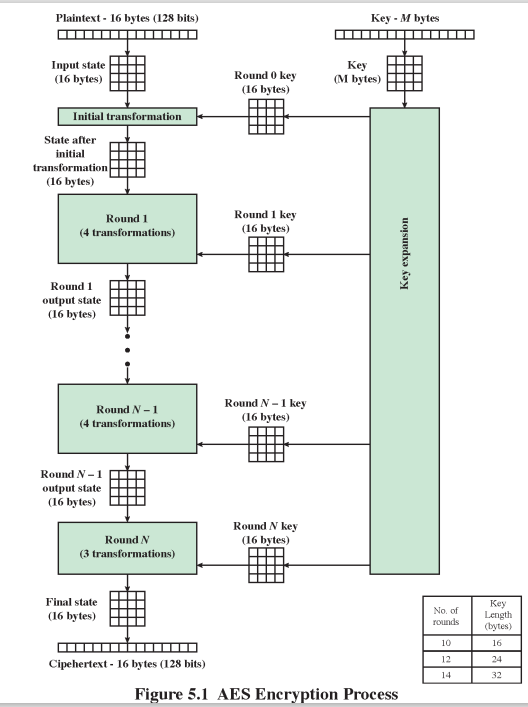

# 정보보안 기말고사 공부  
## 0장  
### 현대 암호학의 선구자들  
정보보안의 아버지 <b>Claude Elwood Shannon</b>
암호학에 새로운 방향성을 제시한 <b>W.Diffie and M.Hellman</b>  
전자서명을 위한 방법과 Public-Key 암호시스템을 개발한 <b>R.Rivest, A.Shamir, L.Adleman</b>  

과거에 암호는 군용기술이었다.  
암호는 개인이 공부하지 못하였고, 따라서 암호연구는 몰래 숨어서 했다.  

## 1장  
컴퓨터 보안이란  
정보 시스템 자원에 대한 무결성, 가용성, 기밀성 유지와 같은(CIA) 목적 달성을 위해 자동화된 정보시스템에 적용되는 보호  

### CIA triad (보안 3요소)  
- Confidentiality (기밀성) : 메세지를 숨기는 것. 인증된 권한이 있는 사람은 읽을 수 있고 권한 없는 자는 읽을 수 없음  
- Integrity (무결성) : 데이터가 위변조 되지 않도록 하는 것.  
- Availability (가용성) : 시스템이 항상 안정적으로 유지될 수 있는 것. 항상 사용가능하게 동작하도록 하는 것.  
- 추가적으로... Authenticity (인증된), Accountability (뚫렸을 때 누구의 책임인가.. 책임추궁) 등  

### 보안 공격 (Security Attacks)  
보안 공격에는 Passive attacks(수동적/소극적 공격)과 Active attacks(능동적/적극적 공격)이 있다.  
보안에서는 기본적으로 통신채널이 언제든 도청 당할 수 있음을 가정한다.  
수동적 공격은 메세지를 보는 것이고, 능동적은 메세지를 수정하는 등 직접적인 영향을 주는 것  

수동적 공격은 직접적으로는 큰 영향은 주지 않지만 (공격의 심각성은 낮음) 공격대상자가 알아차리기 어렵다. 도청이 그 예시  
능동적 공격은 직접적으로 영향을 주는 대신, 공격이 일어났는지 감지되는 경우가 많다. 값을 위변조하는게 예시  

<b>수동적 공격</b>  
- Release of message contents : 중간에 도청하여 메세지 내용을 보는 공격  
- Traffic analysis (트래픽 분석) : 암호를 걸어서 메세지를 볼 수 없더라 해도, 네트워크 통신을 주고 받은 빈도수 혹은 누구와 통신을 했는지 등 트래픽 분석으로도 유의미한 정보를 습득할 수 있다.  

<b>능동적 공격</b>  
- Masquerade : 송신자를 Fake 치는 것. 마치 Bob이 송신한것처럼 보이지만 사실은 Darth가 보낸 메세지. 수신자에게 혼동을 줄 수 있다.  
- Replay : 요청을 다시 보내는 공격이다. 예를들면 송금 요청을 보내면 그 유효메세지를 그대로 다시 보내는 것  
- Modification of messages : 송신자가 수신자에게 메세지를 보내면 중간에 빼돌려서 메세지를 복제하여 수신자에게 보내는 것.  
- Denial of service (Dos) : 서버를 망치는 공격. 물리적으로 부수거나, 서버 관리자를 매수하거나 등이 있지만 실질적으로 쓰이는 DoS공격은 '강제로 트래픽을 증가시켜 과부화가 오도록 하는 것'을 주로 말한다.  
DoS공격을 위해서는 디바이스 수가 많아야한다. 그래야 구별이 어렵기때문. 요즘에는 DDoS공격을 주로 한다. (Distributed DoS)  
트래픽 증가를 위해 10만대의 컴퓨터를 쓰는 것보다는 관리자 매수가 빠를텐데, 그래서 바이러스를 사용하여 여러 컴퓨터들을 DoS를 위한 디바이스로 사용한다.  

보안서비스는  
Authentication(아이디 비밀번호로 확인하는 등), Acces control(접근을 통제. 집의 현관문), Data confidentiality, Data integrity, Non-repudiation(부인방지 부인봉쇄 시스템. 이걸위해 전자서명을 함)..  

## 2장  
### 대칭키암호(Symmetric Encryption)  
conventional, secret-key, single-key encryption으로도 불림  
1970년 public-key encryption이 나오기까지 유일한 암호체계였다.  
두가지 유형 암호화 중 가장 널리 사용되는 암호화  
송신자와 수신자는 공통키를 공유한다.  
모든 classical encryption algorithms는 symmetric이다.  

기본용어(Basic Terminology)  
plaintext, ciphertext, cipher, key, encrypt, decrypt, cryptography (암호화 원리와 방법을 연구하는 자), cryptanalysis (키를 모른 채 암호문을 해독하는 원리와 방법을 연구하는 자. codebreaking), cryptology (암호학 및 암호분석 분야)  

대칭키 암호는 plaintext를 key를 사용하여 encryption algorithm으로 넣고 전송한뒤, 똑같은 key를 사용하여 decryption algorithm을 사용하면 다시 plaintext가 됨.  

보통 Symmetric Cipher Model은 message X를 Key를 기반으로 Encryption하고, Y=E(K,X)로 Destination에 송신한다.  
하지만 통신이 이루어지는 Y의 경우를 안전하지 않다고 가정한다. Cryptanalyst는 이 Y를 빼돌려서 K와 X를 유추한다.  
Key는 Secure Channel에 의해 Destination쪽에 보내지는데,  
통신으로 받은 Y를 Secure로 받은 K를 통해 Decryption하여 Message를 수신한다.  

### Kerckhoffs의 원리  
암호화 방법은 꼭 비밀일 필요는 없다. 언제나 적들에게 알려질 수 있다. 오히려 공개되어 있어야 한다?  
그러면 결국, 'Key'에만 의존하는 암호방식을 사용해야한다. key는 적에게 노출되지 않음  
알고리즘 공개 장점 : cryptanalysis가 깨기 위해 노력하고 그 정보를 통해 더 강화된 암호 가능  

- Cryptanalytic attacks (암호분석식 공격)  
ciphertext-only attack : 암호문만 보고 원문을 알려하는 것  
known-plaintext attack : 원문 예시들을 우연하게 좀 알고나서 암호를 해독하는 것  
chosen-palintext attack : 원하는 원문을 넣어보며 암호를 공부하고 해독하는 것  
chosen-ciphertext attack : 원하는 암호문을 해독 알고리즘에 넣어보며 이를 공부하고 공격하는 것    
- Brute-force attack (무식한 문제 해결)  

### 암호 종류 - Classical Substitution Ciphers  
- Caesar cipher / shift cipher  
- Monoalphabetic ciphers  
- Polyalphabetic ciphers / Vigenere cipher  
- One-time pad  

<b>Caesar cipher</b>은 shift cipher의 기초이다. 3개씩 문자를 뒤로 밀어서 출력하는 알고리즘  
a부터z까지 0~25의 숫자로 1:1 매칭을 시킨다.  
그리고 Encryption을 할 때 Key값(3)을 원문숫자에 더하여 ciphertext로 바꾼다.  
식으로 정리하면  
c = E(3,p) = (p+3) mod 26  
p = D(3,c) = (c-3) mod 26  
예를 들어 e(4)값을 넣으면 4+3=7이라 h가 나온다.  
<b>Shift cipher</b>은 언제나 3개씩 뒤로 미는 Caesar cipher를 보완한 방법이다.  
Caesar cipher은 언제나 똑같은 방법으로 밀었기에 Key가 없었다. shift cipher은 방법은 똑같지만 Key를 통해 미는 양을 정한다.  
c = E(k,p) = (p+k) mod 26  
p = D(k,c) = (c-k) mod 26  
> 하지만 1번~26번 미는 bruteforce 방식으로 충분히 쉽게 파훼할 수 있다.  
밀다보면 원문이 나오기때문이다.  
문제는 KeySpace(범위)가 26밖에 안된다는 점이다. 더욱 큰 것이 필요  

<b>Monoalphabetic Ciphers</b>는 a~z를 순차적으로 밀지 않고, 랜덤하여 숫자를 배정한다.  
이렇게되면 key의 가지수가 26!(26팩토리얼)만큼 나온다. 약 2^88로 BruteForce가 불가능하다. 하지만 경우의 수를 제거하다보면 조금은 쉬워진다.  
> 원문을 바로 알 수는 없지만 같은 알파벳이 몇번 쓰이는지는 알 수 있을 것이다.  
이 말은 즉슨, 정보가 많이 들어오면 올수록 자주 쓰이는 알파벳을 분석하여 원문의 방식을 유추할 수 있게 된다.  
잘 안나오는 문자는 q,x,z같은 문자이고, 빈도수가 잦은 문자는 e,i 같은 것이 있다.  
결국 대입을 잘 하다보면 유추가 가능해진다.  
Frequency Analysis라는 영단어 알파벳 빈도수 분석 자료를 사용하여 정보가 길어질 수록 저 자료와 유사해질것이고, 이렇게 대입하여 풀다보면 풀 수 있게 된다.  
t뒤에x는 없고 q뒤에u, t뒤에h 처럼 자주 나오는 규칙도 있으니.. 아무튼 긴 문장에서만 가능하겠지만 이런 유추가 가능해진다.  
통계로 해결되지 않기 위해선 여러번 등장한 알파벳이 같은 알파벳일수도, 아닐수도 있어야함. 따라서 Frequency Analysis가 평평하도록 만들어지게...  

<b>Polyalphabetic Cipher</b>  
암호문에서 알파벳들의 분포가 Flat하도록 설계하는 방법이다.  

<b>Vigenere Cipher</b>  
shift cipher의 반복. 자릿수마다 키를 다르게하여 key+plaintext=ciphertext 방식으로 함.  
예를 들어 key를 LEMON으로 두면,  
KEY : LEMONLEMONLE...  
PLA : ATTACKTODAWN  
CIP : LXFOPVEFRNHR  
plaintext가 a~z를 0~25로 나타냈듯이, key도 똑같이 0~25로 나타내고 key와 plaintext를 1:1로 더해주어 ciphertext를 출력한다.  
> Kasiski's method로 파훼되었다.  
반복되는것을 찾았다. Key의 자릿수가 9자리 수라면 우연히 단어가 겹치는 것은 9또는 3의 배수마다 단어 겹침이 이루어 질 것이다.  

Vigenere Cipher의 강화법은 Key를 메세지만큼 길게 사용하는 것이다.  
<b>One-Time Pad</b>  
위 Vigenere Cipher의 강화법을 사용한 것이 바로 OneTimePad이다.  
메세지 길이만큼의 Random Key를 갖는 암호로 a~z까지의 0~25의 수, 그리고 여백(26)까지 key로 사용한다.  
> One-Time Pad는 완전암호를 만족한다! 절대 깨지 못한다는 안정성을 가진다.  
현재까지도 깨지 못하는 방식이다. 하지만 사용하지 않는 이유가 있다.  
메세지와 키가 똑같은 길이는 갖는다는 것은 그만큼 key의 용량이 매우 크다는 것.  
안전하지만 용량때문에 사용이 불편하고 어렵다.  

이처럼 key의 길이가 메세지 길이만큼 길면 완전암호를 만족할 수 있는 것을 알았다.  
현대암호는 이러한 점도 중요하지만 '쓰기 쉬운' 암호 또한 중요하다고 여기고 있다.  

### Transposition Cipher  
암호는 심볼대체, 위치변경 두가지 방법밖에 없다.  
위에서 알아본 Caesar, Shift, Monoalphabetic, Polyalphabetic, Vegenere, One-Time Pad는 모두 심볼대체 Cipher이다.  

위치변경(Transposition) Cipher는 무엇이냐,  
말 그대로 위치를 바꾸어주는 것이다.  
- Rail fence cipher  
meet me after the toga party를  
m e m a t r h t g p r y  
 e t e f e t e o a a t  
=> mematrhtgpryetefeteoaat  
이렇게 만드는 방법.  
- Columnar transposition cipher  
문장을 원하는 길이 단위로 잘라서 열로 만들고,  
attack postponed until two am  
라는 문장을 예를들어 7개의 알파벳씩 잘라서 7개의 열로 이루어진 행렬로 만들고,  
1 2 3 4 5 6 7의 열 순서로 이루어진 문장을 key로 4 3 1 2 5 6 7 처럼 랜덤하게 둔뒤 1번 열에 있는 알파벳들-> 2번 열에 있는 알파벳들 -> 3번 열... 이렇게 쭉 나열하는 것이다. 위 문장을 예시로 들면  
attackp  
ostpone  
duntilt  
woamxyz  
가 될 것이고, key가 4312567 이라면  
ciphertext : ttnaaptmtsuoaodwcoixknlypetz 이다.  

암호 보안성 면에서 보았을 때,  
substitutions와 transpositions의 방식은 언어의 특성 때문에 그리 안전하지 않다.  
그래서 암호방식을 여러번 사용하여 더욱 안전하게 만든다.  
substitution을 2번 쓰는 것 혹은 transposition을 2번 쓰는 것 보다,  
substitution과 transposition을 섞어서 사용하는 것이 훨씬 안전한 암호를 만드는 방법이다.  
<b>이것이 classical에서 modern 암호학으로 넘어가는 다리 역할</b>  

### Steganography (암호화의 대안)  
alternative to encryption인데..  
메세지 존재 자체를 숨기는것.  
보이지 않는 잉크를 쓰거나, 그래픽 이미지나 사운드 파일에 숨기거나..  
encryption의 사용을 모호하게 할 수 있다는 장점이 있지만 비교적 작은 양의 정보를 숨기기 위해 훨 큰 데이터가 필요.  

## 3장  
Modern Block Ciphers (현대 블럭 암호)  
의 디자인 원리에 관해서 알아본다.  
그 중에서 DES(Data Encryption Standard)에 대해 알아볼 예정.  

Block Cipher과 Stream Cipher가 있는데,  
Block Cipher은 메세지를 블록단위로 처리하고 encryption, decryption한다. 헤드+내용여러개  
Steam Cipher은 encrypt/decrypt할 때 메세지를 bit나 byte로 처리한다.  
현재의 많은 암호들은 Block Cipher이다.  

plaintext->ciphertext가 될 때 비트or바이트 하나 하나를 암호화하는지, 블럭 단위로 하는지 차이인것이다.  

### 기본적인 사실  
n비트 크기의 plaintext block일 때,
2^n개의 다른 plaintext block이 있다. Reversible mapping의 경우 (암호화가 되면 역함수화 하면 암호해독 = 1:1매칭) 2^n!의 경우의 수를 가진다.  
테이블로 정의되는 key의 길이는 2^n*n비트다. (plaintext block개수*key길이)  
(블럭size가 2비트면, 2^2=4개의 블럭 존재. 키 경우의수는 4!=24가지. 테이블로 정의되는 key길이는 8비트) 블록이 조금만 커도 경우의 수가 매우 커진다.  

### Shannon : Substitution-Permutation Ciphers  
Claude Shannon은 1949년 논문에서 S-P(Substitution-Permutation) 개념을 소개했다.  
S-P 네트워크는 현대 암호학의 기초이다.  
S-P 네트워크는 두개의 원시적 암호화작업을 기반으로 한다. substitution(S-Box)와 permutation(P-Box)  

<b>A 3-round Substitution-Permutation Network</b>
구조를 보면 plaintext가 K0을 XOR하여 S박스 4개에 들어가고 그 값들이 P박스에 들어가서 섞어지면 라운드1. 이후 출력값에 K1키가 XOR되어 S-P박스에 들어가면 라운드2. 이후 출력값에 K2가 XOR되고 마지막라운드3에선 S박스만 통과한뒤 출력값을 K3에 넣어 ciphertext가 된다.  

<b>Feistel Cipher Structure</b>  
Shannon의 S-P Network에선 S-Box가 invertible해야한다(가역적)  
Feistel Cipher 구조에서는 S-box가 invertible할 필요가 없다.  
따라서 Feistel Network는 non-invertible 성분으로부터 invertible구조를 형성하는 방법이다.  
- Encryption : RE16 = LE15 XOR F(RE15, K16)  
- Decryption : RD1 = RE16 XOR F(LE16, K16)  
- RE15 = LE16  
- RD1 = RE16 XOR F(LE16, K16) = LE15 XOR F(RE15, K16) XOR F(LE16, K16) = LE15  
따라서 RD1 = LE15  

<b>A xor 0 = A, A xor A = 0</b>  

Key가 1~n개 있고 여러번 암호화 한 것을 다시 역함수를 거치면 풀린다. non-invertible하지만 전체구성에선 역함수가 가능한 구조.  
라운드 거치며 섞기도, 함수에 넣기도, 그대로 가져오기도하며 점점 암호화가 진행됨  
(그대로 끌고 내려오는 것 반, 섞는것 반. 라운드 거치며 복잡. Inverse존재할필요 X)  
이렇게 F가 non-invertible해도 되기에 디자인하기 편하다.  
Decryption에선 아래서부터 위로 거꾸로 올라가기만 하고 F도 그대로 적용. 순서만 맞으면 됨  

Fiestel Cipher의 설계 요소 : Block size, Key size, Number of rounds (RoundFunction과 연관. 라운드마다 같은 Key쓸지 매 라운드마다 키를 준비할지 라운드별로 Key를 변화시킬지 결정할 것), Subkey generation algorithm, Round function  

### DES (Data Encryption Standard)  
64비트 데이터블록, 56비트 키  
IBM에서 1960년 후반 Horst Feistel이 암호 연구를 시작함.  
이 프로젝트는 1971년 'Lucifer' 암호 개발로 끝이남.  
Lucifer는 64비트 데이터 블록, 128비트 키를 가진 Feistel Block Cipher이다.  
1973년 NBS는 국가암호표준에 대한 제안요청 발행  
IBM은 수정된 루시퍼를 DES로 승인함. (정부가 조금 도움을 주어 바꿔나옴)  
> 설계시에 논란이 있었음.  
Lucifer는 128비트의 키를 가짐. 근데 DES로 바뀌면서 56비트의 키가 됨.  
설계 기준 분류는 S-Box  
NSA(No Search Agency) - 데이터분석부서. 모든 통신을 도감청함  에서 상업용 암호로 재개발된것.

아무튼  
DES는 64비트의 KEY가 들어오고 그 중 56비트가 추려저 사용된다.  
7비트의 정보+1비트의 패리티비트 * 8개 = 56+8 = 64비트  
홀수패리티비트는1, 짝수패리티비트는0.  
(데이터가 바뀌어있으면 짝수개여야하는데 홀수개. => 오류 검증)  

DES는 라운드의 시작과 끝에 Initial permutation 그리고 Inverse Initial permutation이 사용된다.  

예전에는 DES를 공부? = F를 공부하는 것  

64비트의 키에서 패리티비트 8비트 버리기 => Permuted Choice 1 (56비트) => 라운드 넘겨주며 Permuted Choice 2로 8비트 버려서 주고 => 다음 라운드로 가기 전에 Key를 Shift.  
다음 라운드에서도 shift된 56비트를 8비트 버려서 Permuted choice 2하여 Round2에 전달.  
<b>Y = IP^(-1)(X) = IP^(-1)(IP(M))</b>  

DES Round 구조  
32비트의 L, 32비트의 R로 구성되어 있다.  
DES는 Feistel 암호에 대해  
Li = R(i-1)  
Ri = L(i-1) XOR F(R(i-1), Ki)  
1. F는 32비트 R과 48비트의 subkey를 사용한다.  
2. 따라서 F를 48비트로 Expansion(확장) permutation 하고  
3. 그렇게 나온 48비트의 expanded R과 48비트 Key를 XOR 한다.  
4. 그 뒤 8개의 S-box들에 값을 넣어 32비트의 결과를 얻어낸다.  
5. 32비트의 결과를 P-Box에 넣어 Permutation하여 F함수의 결과를 도출한다.  

이후 F함수를 거친 32비트 R(i-1)값은 32비트의 L(i-1)값과 XOR하여 Ri 값이 된다.   

### DES 알고리즘 파악  
- E-Box (Expansion Permutation) : Expansion은 32비트가 입력되면 8행 4열로 만들고, 한 행당 맨앞과 맨뒤에 이어지는 수를 붙여서 만든다. 1번 수 앞엔 32번째 수, 4번 뒤에는 5번 수... 32번 뒤에는 1번 수..  
- P-Box (Permutation Function) : Permutation Table(4x8행렬) 에 index들이 적혀있는데, 입력되는 32비트의 index에서 값을 가져온다.  
- S-Box (Substitution Boxes) : 6bit input to 4bit output 이다. 6비트가 들어오면 0번, 5번비트를 행으로하고 (00, 01, 10, 11 4개의 행을 결정) 1~4번비트를 열로하여 15개의 열로 만든다. 011011은 행이 01, 열이 1101이므로 [1][13]인덱스. 즉 2행 14열이다.  
S-Box는 테이블로 존재한다. 4행 16열로 존재하는 테이블을 매칭해주는 것.    

Round Function F 구조 : R(32)->E->(48) XOR K(48)-> S1~S8 -> (32) -> P -> 32 bits result  

64비트의 Key에서 매 8번째 bit는 무시된다.(패리티비트)  
그렇게 Permuted Choice1은 56비트를 고르게 된다.  
56비트의 Key는 C0와 D0로 28비트씩 이등분한다.  
Key Rotation Schedule 테이블을 사용하여 Key를 개별적으로 1혹은2칸 shift left 한다. (만약 한칸씩 shift left하는 구조라면 28번 라운드 지나면 다시 돌아옴)  
2차 Permuted Choice는 48비트로 Table에 맞게 Permutation하여 뽑아내고, 이후 F함수 내에서 XOR하는 용도로 쓰인다.  

16번의 라운드를 거치면 거의 모든 문자가 다른 결과를 낼 것이다.  

> DES 깨는 방법. 현재는 key가 56비트라 좋은 컴퓨터를 사용하여 Brute-Force하면 깨진다.  
옛날에 (98년) 3억을 들여 DES를 깨는 기계 만들었는데 이 덕에 이틀만에 깨졌다.(EFF's DES-cracker)  
그 이유는 Key가 짧아서. 이제는 안전하지 않다.  
다음 세대의 암호탐색은 AES이다.(현재까지 사용)  

구조를 보고 Feistel구조가 아닌것 아닌것을 예시로 보고 알 수 있어야 한다.  

## 4장  
### Algebra  
수학은 Algebra와 Analysis 두 부류로 나뉜다. 주로 컴퓨터, IT쪽에서 Algebra를 사용한다.  
컴퓨터는 실제 넣을수있는 유효숫자가 얼마 되지 않기에 Real Number를 다룰일이 없다. (표현하기 어려움. 예를들면 파이)  
TCP-IP에서는 데이터를 받았는데 깨지면 다시 보내라고 하지만, 위성통신에선 깨진것을 복구하여 통신  

컴퓨터에서 수를 정확히 나타내려면 일단 Finite(유한)해야한다.  
사칙연산이 가능한 유효숫자를 원함. 위성통신에서도 약간의 오류는 복구할 수 있도록.  

정수도 무한집합인데, 이것을 유한집합으로 만들고 처리.  

### Divisibility  
a=mb 꼴로 둘 수 있다면 a/b가 가능하다고 봄. b|a는 b divides a  
a|1은 a=+-1이고, a|b 이고 b|a이면 a=+-b이다.  
모든 0이 아닌 b는 0을 divides한다.  
a|b이자 b|c이면 a|c이다.  
b|g이고 b|h이면 b|(mg+nh)할 수 있다. (m,n은 임의의 정수)  
a를 n으로 divides하면 a=qn+r, 0 <= r < n , q=내림a/n  
내림이라는건... 내림(11/7)이면 1.xxx이니까 1이되고,  
내림(-11/7)이면 -1.xxx이니까 '내려서' -2가 된다.  
> 코딩에서는 int n = -11/7 하면 -2가 아니라, -1이 나올 것이다.  
표준이 0을 바라보고 가장 가까운 숫자를 택하는 것이 되었기 때문이다.  

연산자 11%7=4가 당연. 근데 -11%7=3이 아니라 -4가 나온다.  
위에서 -11/7=-1로 정의되었기 때문이다. 이론과 프로그래밍의 차이.  

모든 수는 Prime Number(소수)들로 만들 수 있다.  
우리가 컴퓨터에서 사용하는 모든 수는 소수들을 곱하여 만든것이다.  
<b>최대공약수(GCD : Greatest Common Divisor)</b>는  
gcd(a,b) = max[k, such that k|a and k|b]  
gcd(a,b) = gcd(a,-b) = gcd(-a,b) = gcd(-a,-b)  
gcd(60,24) = gcd(60,-24) = 12  

두 정수가 '서로소'하다는 것은 무엇을 의미하느냐,  
두 수의 공약수가 오직 양의 정수 1밖에 존재하지 않다는 것. 예를들어 8과 15  

우리가 수학에서 소인수분해를 하는 방식은 두 수를 두고 공약수로 계속 나누는것! 언제까지? 안나눠질때까지  
<b>근데 숫자가 커질수록 소인수분해는 어렵다.</b>  

gcd를 구하라는 것은 divisor(공약수)을 구하라는 것과 같다.  
너무 수가 크면 어렵다. 따라서 소인수분해가 아닌 다른 방법으로 GCD를 구하는 방법? ==> Euclidean Algorithm  
### Euclidean Algorithm 유클리디안 알고리즘  
d = gcd(a,b)를 찾는 것  
gcd(a,b) = gcd(|a|,|b|) , a>=b>0  
우리는 이러한 조건에서  
a = q1*b + r1 , 0 <= r1 < b 이 된다.  
- 만약 r1=0이면, b|a 이고 d=gcd(a,b)=b가 된다.  
- 만약 r1이 0이 아니면, d|r1 이고 d=gcd(a,b)=gcd(b,r1)이다.  
=> d|a이자 d|b의 관계는 d|(r1=a-q1*b)라고 할 수 있다.  
c=gcd(b,r1)으로 생각하면,  
d|b와 d|r1 에서 d<=c를 얻을 수 있다.  
c|(a=q1*b+r1)과 c|b 로 우리는 c<=d를 얻을 수 있다.  
따라서 c=d이다. 그래서 gcd(a,b)=gcd(b,r1)이다.  

a=q1*b + r1 , 0 <= r1 < b  
b=q2*r1 + r2 , 0 <= r2 < r1  
r1=q3*r2 + r3 , 0 <= r3 < r2  
...  
r(n-2) = qn*r(n-1) + rn , 0 <= rn < r(n-1)  
r(n-1) = q(n+1)*rn + 0 이면...  
<b>d = gcd(a, b) = rn</b> 이다.  

이 방식은 b=r0으로 두고 한 것이다.  
한 스텝마다 d=gcd(ri, r(i+1))을 한다. 언제까지?  
d=gcd(rn, 0) = rn이 될 때까지  

> 예로 gcd(1970, 1066)을 해본다.  
1970 = 1 * 1066 + 904 ... gcd(1066, 904)로  
1066 = 1 * 904 + 162 ... gcd(904, 162)  
904 = 5 * 162 + 94 ... gcd(162, 94)  
162 = 1 * 94 + 68 ... gcd(94, 68)  
94 = 1 * 68 + 26 ... gcd(68, 26)  
68 = 2 * 26 + 16 ... gcd(26, 16)  
26 = 1 * 16 + 10 ... gcd(16, 10)  
16 = 1 * 10 + 6 ... gcd(10, 6)  
10 = 1 * 6 + 4 ... gcd(6, 4)  
6 = 1 * 4 + 2 ... gcd(4, 2)  
4 = 2 * <b>2</b> + 0  
따라서 gcd(1970, 1066) = 2  

정말 큰 수로 넘어가도 이렇게 풀 수 있다.  
gcd(1160718174, 316258250)이면 10번으로 구해진다.  
비교적 쉬운 방법으로 최대공약수(gcd)를 구할 수 있음  

### Modulus 모듈러스 . 나머지표기 mod  
11 mod 7 = 4, -11 mod 7 = 3  
73 ≡ 4(mod 23), 21 ≡ -9(mod 10) [1(mod 10)아닌가?]  

modulus의 존재는 왜? 정수를 유한집합으로 하고싶어서?  
n mod n = 0이다.  

<b>Modular Arithmetic(모듈러 연산)</b>    
- a ≡ b(mod n) / 나머지가 같다면.. (n|(a-b)) 양변에 b를 빼면 a-b ≡ 0이다. 즉 n이 a-b를 나누어 떨어짐  
- a ≡ b(mod n) 이면 b ≡ a(mod n)이다.  
- a ≡ b(mod n) 과 b ≡ c(mod n) 은 a ≡ c(mod n)을 의미한다.  

<b>Modular arithmetic operations 산술연산</b>  
(a+b) mod n = [(a mod n) + (b mod n)] mod n  
(a-b) mod n = [(a mod n) - (b mod n)] mod n  
(axb) mod n = [(a mod n) x (b mod n)] mod n  

> 11 mod 8 = 3, 15 mod 8 = 7  
[(11 mod 8) + (15 mod 8)] mod 8 = 10 mod 8 = 2  
(11+15) mod 8 = 26 mod 8 = 2  
[(11 mod 8) - (15 mod 8)] mod 8 = -4 mod 8 = 4  
(11-15) mod 8 = -4 mod 8 = 4  
[(11 mod 8) x (15 mod 8)] mod 8 = 21 mod 8 = 5  
(11x15) mod 8 = 165 mod 8 = 5  
만약 11^7 mod 13 이면.. 11^2=121≡4(mod 13) 를 활용  
11^4 = (11^2)^2 ≡ 4^2 ≡ 3(mod 13)  
11^7 = 11 x 4 x 3 ≡ 132 ≡ 2 (mod 13)  
이런식으로 문제 해결이 가능하다.  

<b>Arithmetic Modulo 8</b>  
8의 Modulo 산술. 0~7의 값으로 표현된다.  
inverse(역원)가 존재하는가에서 덧셈의 경우엔 더해서 0이되는 것을 찾으면 되고, 곱셈의 경우엔 곱해서 1이되는 경우를 찾으면 된다. A - A = 0, A * A^(-1) = 1  
Modulo 8의 경우에는 덧셈의 inverse(역원)는 전부 존재하지만 곱셈의 경우에는 0, 2, 4, 6에서 곱해서 1이 나오는 수가 존재하지 않는다. 왜냐면 8이 서로소가 아닌 수기때문이다.  
modulo 8의 예시는 2x7=14mod8=6, 2x7x3x4는 계산할 필요없이 2x4가 8이기에 0임  

### 나머지 집합  
Zn={0,1,...,(n-1)} 는 mod n의 집합을 의미한다.(나머지 집합:set of residues)  
(w+x) mod n = (x+w) mod n. 곱셈도 마찬가지  
mod n을 거치기 이전에 있는 괄호에서는 그냥 우리가 평소에 알던 수 체계마냥 결합 분할 다 할 수 있다.  
[(w+x)+y] mod n 을 [w+(x+y)] mod n으로 바꾸든..  
[w*(x+y)] mod n 을 [wx+wy] mod n 으로 바꾸든.  
(0+w)mod n 을 w mod n으로, (1*w)mod n을 w mod n으로 바꾸든..  
w가 Zn집합의 원소이면 (mod n 의 나머지) w+z≡0modn이 존재  

<b>Modular 연산의 특징(Properties)</b>  
- 만약 (a+b)≡(a+c)(mod n) 이면, b≡c(mod n)이다.  
(그냥 두 항에 -b한거 아님?)  
예를 들어 5+23 ≡ 5+7 (mod 8)이면, 23 ≡ 7(mod 8)이다.  
- 만약 (axb)≡(axc)(mod n) 이면, b≡c(mod n)이다. 단 a가 n과 서로소여야 한다.  
예로 6x3≡2(mod 8) 이라면... 2x3x3≡2x1(mod 8)이니까 3x3≡1(mod 8)이다? 어 되네.  

서로소가 아니라면 예를들어 a=6이고 n=8이다?  
modular 8에서 6의배수mod 8을 하면 나머지가 0,6,4,2,0,6,4,2가 된다.  
6x0 mod 8이나, 6x4 mod 8이나 같음. 위에 우리가 썻던 공식 만족 X  
하지만 a와 n이 서로소라면, a=5, n=8  
5의 배수mod 8의 경우에 나머지가 0,5,2,7,4,1,6,3으로 중복없는 나머지 집합을 가지게 된다.  
이런 경우에 위에서 얘기한 공식을 적용 가능.  

### Extended Euclidean Algorithm  
gcd(a,b)를 했을 때 d만 나오는 것이 아닌, ax+by=d의 형태의 표현이 추가적으로 나오는 알고리즘을 말한다.  
> 예를들어, gcd(259, 70)  
259 = 3(70) + 49 /// 49 = 259 - 3(70)  
70 = 1(49) + 21 /// 21 = 70 - 1(49)  
49 = 2(21) + 7 /// 7 = 49 - 2(21)  
21 = 3(7) + 0 /// = 49 - 2(70 - 49)  
............./// = 3(49) - 2(70)  
............/// = 3(259 - 3(70)) - 2(70)  
.........../// = 3(259) - 11(70)  
따라서 gcd(259,70) = 7 = 259x3 + 70x(-11)이다.  

목표는 ax+by=d=gcd(a,b)이다.  
a=ax(-1)+by(-1), x(-1) = 1 이고, y(-1) = 0  
b=ax0+by0, x0 = 0이고, y0 = 1  
이 상태에서 r(-1)=a, a = q1b + r1, r1 = ax1 + by1  
r0=b, b = q2r1 + r2, r2 = ax2+by2  
r1 = q3r2 + r3, r3 = ax3+by3  
...  
r(n-2) = qnr(n-1) + rn, rn = axn+byn  
r(n-1) = q(n+1)rn + 0  
그러면 ri = r(i-2) - r(i-1)qi  
ri = axi+byi, 그러면 xi=x(i-2) - qix(i-1) 이고 yi=y(i-2) - qiy(i-1)  

gcd(1759, 550)은 r(-1)=a=1759, r0=b=550, r1=109;q1=3  

### Extended Euclidean 외워야 하는 공식은 딱 이것들.  
- 라운드는 -1부터 시작하여... -1 0 1 2 ... 이순서  
- r(-1) = a, q(-1) = / , x(-1) = 1, y(-1) = 0  
r0 = b, q0 = / , x0 = 0, y0 = 1  
r1 = a mod b, q1=내림(a/b) , x1 = x(-1) - q1 * x0, y1 = y(-1) -y1 * y0  
r2 = b mod r1, q2=내림(b/r1), x2 = x0 - q2 * x1 , y2 = y0 - q2 * y1  
...  
- xi = x(i-2) - qi * x(i-1) 이다. y도 마찬가지  
- 나머지(r)이 0이 될때까지 진행. 나머지가 0이 되기 이전 라운드에 나머지가 d값. 그 줄의 xi, yi값이 ax+by에 들어갈 값들  

### Group, Ring, Field  
테이블만 보고 Addition인지 Multiplication인지 구분할 수 있어야 함. 구분방법 다양한데, 만약 modular 8이면 항등원이 항상 존재하는지.(곱의 역원은 존재안하기도 함) 교환법칙이 성립하는지 등으로 알 수 있다.  

위 예시처럼 수체계의 성질들을 대입해보며 어느 조건까지 만족하는지 파악하여 Group인지, Ring인지, Field인지 확인할 수 있다.  
Field가 가장 큰 범위(모든 수체계 만족), 그 안에 Ring, 그 안에 Group  
A1~A5, M1~M7까지 조건이 총 12가지 있다. 순차적으로 검증해보며 어디까지 만족하는지 확인하면 된다.  

> Group  
(A1) : a와 b가 S에 속해있으면, a+b도 S에 속한다.  
(A2) : a+(b+c) = (a+b)+c 가 S에 속하는 a,b,c 모두에게 적용된다.  
(A3) : S내에서 a+0 = 0+a = a이다.  
(A4) : S에 속하는 a에 대해 -a가 S에 속하면 a+(-a)=(-a)+a = 0이다. (항등원이 존재)  

> Abelian group  
(A5) : a+b = b+a 를 S에 속하는 모든 a,b가 만족

> Ring  
(M1) : a와 b가 S에 속해있으면, ab도 b에 속한다.  
(M2) : 모든 a, b, c가 S에 있다면 a(bc)=(ab)c를 만족한다.  
(M3) : 모든 a, b, c가 S에 있으면 a(b+c) = ab+ac 이고, (a+b)c = ac+bc를 만족한다.  

> Commutative ring  
(M4) : 모든 a, b가 S에 있으면 ab = ba를 만족한다.  

> Integral domain  
(M5) : 항등원이 존재. 모든 a가 S에 있으면 a1 = 1a = a 를 만족한다.  
(M6) : a, b가 S에 있고, ab=0이라면 a=0이거나 b=0이다. 우리가 아는 정수집합이 이러한 조건을 만족한다.  
Z8과 같은 경우를 예를들때 2x4=0이 될 수 있는데(a나 b가 0이 아니여도 0이 될 수 있음) 이런 경우가 Field가 될 수 있음

> Field (위 모든 조건을 만족)  
(M7) : a가 S에 속하고 0이 아닐때, aa^(-1)=a^(-1)a=1을 만족하는 S에 속하는 a^(-1)이 존재한다.  
M7을 만족하면 자동으로 M6을 만족하는거라서 M6을 빼도 된다.  
유리수,복소수,실수들이 field를 만족함  

### Finite Field 유한체와 Galois field GF(p)  
Field를 만족하는 유한체(Finite)  
유한체의 조건에는 prime number개의 원소가 필요하다.  
예를들어 5개의 원소로는 유한체를 만들 수 있지만 6개의 원소로는 유한체를 만들 수 없다.  
<b>원소개수가 p^n꼴 (소수의 지수승)이여야 유한체를 만들 수 있다.</b>  

### GF(p^n) : Galois Field  
1. n=1 : GF(p)  
2. n>1 : GF(p^n)  

### GF(p)  
원소개수가 9개라면 GF(3^2)로 표기한다.  
8로 나눈 나머지 집합은 곱셈은 문제가 없지만 덧셈이 문제?  
애초에 나머지집합은 소수(prime number)를 뽑으면 문제가 없다.  
GF(7)은 따라서 문제가 없다.  
<b>Zp라면 0빼고 다 p에 서로소이고, 따라서 Finite Field를 만족한다.</b>  

GF(p) ~= Zp={0, 1, ..., p-1}  

근데 extended euclidean algorithm에서 x와 y를 구하는데 어디에 사용하는가?  
gcd(a,b)=1이라면 ax+by=1이다. 양변에 mod a하면  
(ax+by) mod a = 1 mod a  
(ax mod a + by mod a) mod a = 1 mod a  
0 + by mod a = 1 mod a  
따라서 y는 b의 곱셈에 대한 역원이다. (y=b^(-1))  

gcd(15,8)이라면, d=1=ax+by=15x(-1)+8x2 이다.  
Z15에서 8의 역원은 2이다. (y가 b의 곱셈에대한 역원이 되었음)  

### Polynomail  
f(x)+g(x) = m시그마(ai+bi)x^i + n시그마aix^i  
f(x)*g(x) = n+m시그마cix^i  
Ordinal Polynomail Arithmetic 정규 다항식 산술  

만약 f(x) = x^3+x^2+2 이고 g(x)=x^2-x+1  
f(x)+g(x) = x^3+2x^2-x+3  
f(x)-g(x) = x^3+x+1  
f(x)*g(x) = x^5+3x^2-2x+2  

Zp에서 계수가 필드F의 요소인 다항식을 생각해본다.  
Polynomial이 GF(p)에서 어떻게 작용하는지.  
GF(2)에서는 계수가 mod 2=0인 식들은 모두 소거한다.  
Addition, Subtraction, Multiplication, Division 모두 해당한다.  

### Euclidean Algorithm for Polynomials  
a(x)=x^6+x^5+x^4+x^3+x^2+x+1 이고 b(x)=x^4+x^2+x+1 일때 gcd[a(x),b(x)]를 한다.  
먼저 둘을 나누어야 몫과 나머지를 구할수있다.  
Euclidean Algorithm 처럼 똑같이 할 수 있다.  
이 경우 gcd(a(x),b(x))=x^3+x^2+1 이 결과값이 된다.  

<b>Irreducible Polynomial(Prime Polynomial)</b>  
소수처럼 동작하는 다항식(polynomail)도 있다. 본인보다 차수가 낮은 두개의 다항식으로 나타낼 수 없을 때를 의미한다.  

예시로 f(x)=x^4+1 이 GF(2) 수 체계에서는 환원이 가능해서 x^4+1 = (x+1)(x^3+x^2+x+1) 이다.  
반면, f(x)=x^3+x+1이면 x+1는 f(x)의 요소가 아니다. gcd가 1이 나온다. (서로소) 이런 경우를 Prime Polynomial(Irreducible Polynomial)이라고 한다.  

### GF(p^n)  
8비트에서 동작하는 알고리즘을 하려면 GF(2^8)을 사용하여 0~255의 수를 나타낼 수 있다. 근데 Z256은 Field가 아님.  
따라서 256에 가까운 prime number를 찾으면 251이다.  
근데 Z251을 하자니 0~250까지는 괜찮은데 251~255를 나타내는 패턴이 사용불가해서 비효율적으로 사용된다.  

GF(2^3)의 유한체 구성하려면 x^3로 시작하는 irreducible polynomial을 택해야한다.  
그 경우 x^3+x^2+1과 x^3+x+1 두가지 경우밖에 존재하지 않는다. (modular x^3+x^2+1 혹은 X^3+x+1)  

m(x)는 사전에 주어진다. 그냥 다 계산하고 GF(2^n)이니까 계수가 2의 배수면 제거하면서 간다.  
f(x)+g(x)를 하거나 f(x)*g(x)를 해서 나타난 다항식의 계수가 m(x)보다 크거나 같으면 나눠야하고, 작으면 그대로 둔다? 인가...  

m(x)가 x^3+x+1일때, x^3 mod m(x)를 하면,
x^3≡x+1(mod m(x)) 가 나온다. 2 mod 2.5 하면 0.5가 나오지 2가 나오는게 아니잖아..??  
이걸 토대로 문제를 풀면 된다.  
비트는 분해하여 XOR로 다시 합칠수있다.  
따라서 shift left하다가 수가 넘어가면, 그 넘어간 비트를 mod 해주고 결과값을 XOR해서 합치면 된다.  

다항식(Polynomial)에서도 Zn 수체계에서 nx+by=1(mod n)을 만족한다.  
m(x)을 수체계로 하는 gcd(a,b)=d 일때, d가 1(최대공약수가 1)이면 nx+by=1 이니까.  
Extended Euclidean Algorithm을 똑같이 적용시켜서 m(x)를 a로 두고, 역원을 구하고자하는 f(x)를 b로 두어 ax+by=1을 구한다.  
그리고 0+by=1, 즉 f(x)y=1 이니까 y=f(x)^(-1)을 만족하는 값을 얻을 수 있게 된다.  

## 5장  
### AES (Advanced Encryption Standard)  
미국국립표준기술연구소(NIST)가 제정한 전자데이터암호화 규격  
두명의 벨기에 암호학자(Joan Daemen, Vincent Rijmen)가 개발한 Rijndael을 기반으로 만들어짐  
AES는 미국 정부에 의해 채택되어 현재까지도 쓰이고 있다. 1977년에 나온 DES를 대체한다.  
15개의 첫 라운드 후보자들... CAST256, CRYPTON, DEAL, DFC, E2, FROG, HastyPudding, LOKI97, MAGENTA, MARS, RC6, Rijindael, SAFER+, Serpent, Twofish  

<b>AES 기본 구조</b>  
- GF(2^8)의 수체계를 기반으로 한다.  
- m(x)=x^8+x^4+x^3+x+1 그러므로 x^8=x^4+x^3+x+1 이다.  
- AES의 plaintext block size는 128비트이다. (16바이트) AES종류와 무관함  
- Key의 길이는 128, 192, 256비트가 될 수 있다. 이것에 따라 AES128, AES192, AES256이 결정된다.  
- 라운드의 개수는 10, 12, 14이다.  
- 4바이트의 4개의 열이 존재하는 형태이다. 4x4의 바이트들로 구성되어있음 (Block Size 16바이트)  
행렬에 넣는 순서는 <b>column 순서를 표준</b>으로 삼았다.  
- 유사하게 Key 또한 4x4의 16바이트 행렬로 전달된다.  

  

<b>AES의 특징</b>  
AES는 Feistel구조가 아니다.  
DES는 하나의 구현으로 Encryption과 Decryption에 사용가능한 F함수를 만들 수 있는데, AES는 둘 다 구현해야 한다. 보통 Encryption을 열심히.  
4개의 다른 reversible transformations이 사용되었다. 가역적임  
- SubBytes  
- ShiftRows  
- MixColumns  
- AddRoundKey  

AES128을 기준으로 말하면 AddRoundKey변환으로 시작하고 그 다음 각각 4개의 변환을 모두 포함하는 9개의 라운드, 그리고 10번째 Round에서는 3개의 Transformation만 사용한다.(mix column 제외)  
Key는 오직 AddRoundKey transformation에서만 사용한다.  

AES는 각각의 transformations에서 역함수가 존재한다.  
각각의 transformation에 대해 간단히 설명하면,  
- SubBytes : S-Box인데, S-Box에 행렬로 값이 입력되면 입력받는대로 테이블에 적힌 위치에 값들을 위치변환하여 저장한다. inverse S-Box하면 그대로 거꾸로 돌아감  
- ShiftRows : 행별로 섞는 방법이다. 1번 행은 그대로, 2번행은 1칸씩 왼쪽으로 shift, 3번행은 2칸씩 왼쪽 shift, 4번행은 3칸씩 왼쪽 shift  
Inverse는 오른쪽으로 shift하면 된다.  
- MixColumns : 열을 섞는다.   
- AddRoundKey : 첫번째 행렬은 State, 두번째 행렬은 round key.  

AES에서 Key Expansion(키 확장)은 어떻게 이루어지는가?  
1byte의 키 16개를 사용하여 4bytes짜리 키 44개를 채운다.  
첫 4개의 워드는 1byte 키 16개 그대로 카피.  
(1234, 5678, .... 13141516) 총 4개의 워드  
본인보다 index가 1개 적은 키와 4개 적은 키를 XOR해준다.  
index가 4의 배수면 index가 4개 적은애는 그대로 가져오고, 1작은애는 g(x)함수를 거쳐서 가져온다. 그리고 둘이 XOR  
temp=SubWord(Rotation그니까 leftShift Word(temp)) XOR RoundConst[i/4]  

### Inverse AES  
Encryption에서는 라운드 순서가  
Substitue byte -> Shift Rows -> Mix columns -> AddRoundKey  
Decryption의 라운드 순서는  
Inverse Sub bytes -> Inverse Shift rows -> Inverse mix cols -> Add round key  

decryption도 마찬가지로 마지막 라운드 3개의 transformation  
