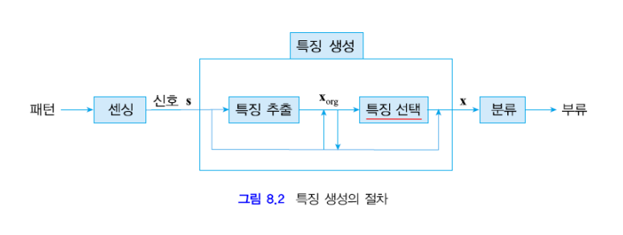

#  기계학습 기말고사 공부  
## 10주차  
### 특징 생성  
필기 숫자 인식과 같은 상황에서 특징 추출을 필요로 한다.  
필기숫자가 적힌 이미지의 크기를 정규화하여 맞추고, 이를 검은색 부분(글자)과 흰색 부분(배경)으로 1과 0을 사용하여 이진화 시킨다.  
이렇게 특징을 추출해낼 수 있는데, 추출 방법은 다음과 같다.  
1. 8x8의 64개의 픽셀을 모두 특징으로 삼아서 64차원의 특징 벡터로 저장하는 방법  
2. 가로 이등분, 세로 이등분을 하여 검은 화소가 몇개 들어있는지 비율을 얻어내어 특징으로 삼는다. 행(세로 2등분) x1=6/18  
열(가로 2등분) x2=14/10  
3. 그 외에도 여러 방법들이 있다.  

<b>특징이 우수한가 판단하는 기준</b>  
- 분별력 : 특징이 어느 한쪽으로 치우치지 않고 좋은 분별력을 가지는가  
- 차원 : 낮은 차원으로도 더 분류를 잘 하는 특징인가  

실제 세계에 있는 정보(Analog)를 패턴을 통해 특징 벡터라는 수학적 표현으로 변환한다.  
이렇게 특징벡터로 어떤 패턴으로 추상화할지는 정해진 것이 아니기에 동일한 데이터라도 특징은 각양각색이 될 수 있다.  
- 보통 특징 추출은 외부환경에 맞게 설계한다.  
숫자와 한글은 다른 특징이 필요할 수 있다는 것, 정면 얼굴만 인식하는 경우와 제약 없이 얼굴 인식하는 경우가 다른 특징이 사용될 수 있다는 것이 그 예시.  

### 특징 추출
특징을 생성하기 위해서는 먼저 특징을 추출해내야 한다.  
실제세계의 정보를 특징벡터로 생성하기 위해 특징을 추출하는데, 그 과정은 센싱을 통해 얻는다.  
센싱에서 얻을 수 있는 신호는 다양한데,  
대표적으로 <b>영상 / 시간성 신호 / 측정 벡터</b>  
이렇게 세가지의 신호를 얻을 수 있다.  
또한 특징은 다양한 상황으로 생성될 수 있다.  
- x.=s. 처럼 센싱된 신호 자체를 특징벡터로 지정할 수도 있고,  
- x.=e(s.) 처럼 특징을 추출하여 특징벡터로 지정할 수도 있고,  
- x.=s(s.) 처럼 특징을 추출한 것 중 마음에 드는 것을 선택하여 특징벡터로 선택할 수도 있고,  
- x.=s(e(s.))처럼 센싱된 신호에서 특징을 추출하고 그 결과 중 마음에 드는 것을 선택하여 특징벡터로 선택할 수도 있다.  

### 주성분 분석 (PCA)  
주성분 분석 : Principal Component Analysis  
훈련집합을 이용해서 매개변수를 추정하고 그것을 통해 특징을 추출하는 것을 의미한다.  
<b>'정보 손실을 최소화하는 조건에서 차원을 축소한다'</b>  
이러한 변환을 Karhunen-Loeve(KL)변환, Hotelling변환 이라고도 부른다.  

<b>주성분 분석을 하는 목적</b>  
정보손실을 최소화하면서 신호 s.를 낮은 차원의 특징벡터 x로 변환하기 위함.  
D차원의 신호s.를 d차원의 특징벡터x.로 변환한다.  
변환행렬 U.는 dxD행렬이다.  

해결해야 하는문제는  
1. 어떻게 차원축소를 표현할지  
2. 정보손실을 어떻게 수량화하여 최소화할지.  

- 차원 축소 표현 : D차원 단위벡터를 u.^T축으로 투영하여 축소한다.  
예를들면 2차원의 s1,s2축으로 이루어진 s.를 임의의 u.^T=(1,0) 벡터를 기준으로 s.에 있는 원소들과 직각이 되는 점을 새로운 1차원의 특징벡터로 나타낸다.  
투영변환된 샘플 ^x = u.^T*s. 이다.

- 정보 손실 공식화 : 원래의 훈련집합이 갖고있는 정보는 샘플들 간 거리, 상대적인 위치 정도이다.  
PCA의 경우에는 샘플들이 원래 공간에 <b>'퍼져있는 정도'</b>를 얼마나 변환된 공간에서 잘 '유지'하는지를 척도로 한다.  
따라서 이를 공식화하면 변환된 샘플들 중 분산을 최대로 하는 축(단위벡터 u.)을 고르는 것이 정보 손실을 줄일 수 있는 공식이라고 할 수 있다.  
> 분산은 샘플들의 평균을 구하고 모든 샘플의 (x-평균)*(x-평균)^T 한 것의 1/n값을 구하면 된다.  

이러한 분산이 가장 큰 공간을 택한다면 차원축소가 그나마 가장 잘 된 경우를 택할 수 있을 것이다.  

분산을 최대화하는 u.를 찾으면 되기에,  
L(u.) 라그랑제 함수를 통해 라그랑제승수가 있는 수식을 미분하고 정리하면  
<b>공분산행렬 * u. = 라그랑제승수 * u. 가 나온다</b>  
즉, 훈련집합의 공분산 행렬 시그마를 구하고 그것의 고유벡터를 구하면 그게 바로 최대분산을 갖는 단위벡터 u.가 된다.  

만약 예로 특정 훈련집합과 그에 관한 공분산 행렬이 존재한다면, 라그랑제승수가 가장 큰 고유벡터를 최대분산을 갖는 u.로 생각하면 된다.  
그렇게 구한 u.^T에 s.를 곱하여 변환된 특징벡터 x.를 구할 수 있다.  

### 변환행렬  
변환행렬을 어떻게 하는지에 따라서 차원축소를 자유롭게 할 수 있다.  
D개의 고유벡터(D차원)가 d개의 고유벡터(d차원)으로 변환된다.  
고유값이 큰 순서대로 d개의 고유벡터를 취한다.  
U. = (u.1^T, u.2^T, u.3^T, ... u.d^T)  
실제로는 x. = U.s. 을 하고 이를통해 d차원으로 변환한다.  

> 구하는 순서는 s.의 집합 X.의 평균벡터를 구하고, 공분산 행렬 시그마를 구한다.  
시그마의 고유벡터와 고유값을 구하고, 고유값을 기준으로 삼아 가장 큰 d개의 고유벡터를 선택한다.  
이렇게 선택된 u1., u2., ... ud.를 통해 변환행렬 U.를 만든다.  

고유값이 작은 u.를 선택했을 때와, 큰 u.를 선택했을 때의 결과를 비교하면 고유값이 작은 u.을 택할때 투영된 점들의 분산값이 더욱 작아지고, 반대로 큰 u.를 택하면 분산값이 커진다.  

### Fisher 선형 분별  
PCA원리와 유사한 분류기 설계이다. 특징추출이 아님. PCA와 목표가 다르다.  
- PCA : 정보 손실을 최소화하며 차원축소 (샘플 부류정보 사용X)  
- Fisher LD : 분별력을 최대화 (샘플 부류정보 사용O)  

축을 기준으로 투영하는것까지는 동일하다. 하지만 분산값을 통해 구분하는 것이 아닌, 여러 축 중에서 가장 기존 분류 결과를 잘 유지하며 차원축소를하는 것을 목표로 한다. (분별력 최대화; 샘플부류정보 필요함)  

**목표 (분별력 공식화)**  
같은 부류는 모여져있고 다른 부류는 멀리 떨어진 것이 가장 이상적인 형태이다.  
w1끼리는 모이고(부류 내 퍼짐은 낮음) w1와 w2는 멀리한(부류 간 퍼짐은 높음) 형태.  
부류 내 퍼짐은 최소화 (평균s1^2 + 평균s2^2 최소화)  
부류 간 퍼짐은 최대화 (평균si^2 = 시그마(y-mi)^2) = |m1-m2| = |w.^Tm1-w.^Tm2| = |w.^T(m1-m2)|

따라서 목적함수 J(w.)는  
J(w.) = 부류간퍼짐/부류내퍼짐 이고, J(w.)를 최대화하는 w.를 찾으면 된다.  
정리하여 다시쓰면 J(w.)=w.^TSbw. / w.^TSwW.  
Sw = S1+S2 이고, Si = 시그마(x.-mi.)(x.-mi.)^T  
구하고자 한 최적의 축은 **w.=알파 Sw^(-1)(m1-m2)**  
알파는 그냥 정해도 되는데 w.의 크기를 조절할 수 있다.  
w.를 1로 만들기 위한 값을 넣는 경우가 많다?  
예를들어 a'(1,4)^T = w. = 1이 되려면..  
a'^2 + (4a')^2 = 1, 17a'^2=1 , a'=1/루트(17)  
w.=(1/루트17, 4/루트17)^T  

### 실용적 관점  
특징 추출은많은 경험을 통해 시행착오를 필요로 하는 단계이다.  
따라서 특징 추출을 위한 기계학습까지 하는 상황. 그 학습을 위해 또 학습을 그 학습을 위해 또 학습을..  

- 특징이 불만족스럽다면 버릴줄도 알아야한다.  
혹은 기존 특징에 새로운 특징을 추가하는 방법으로 특징을 결합해야한다.  
- 특징이 거리개념이 없는 경우도 있다.  
혈액형처럼 거리개념이 없다면, xi를 xi={xi1, xi2, ..., xin}처럼 몇개의 값을 갖는지에 따라 확장시키고, 하나만 1을 갖고 나머지는 0을 갖는 형태로 거리개념처럼 만들어준다.  
예시로 혈액형이 A,B,O,AB이니 xA={1,0,0,0}, xB={0,1,0,0}, ... 이렇게 만들어서 분류해준다.  

특징마다 동적범위가 다른경우가 많다. 예를들어 키는 160~180인데, 몸무게는 40~100으로 큰 차이가 난다고 해보자. 이런 경우 이 둘의 영향력을 같게하기 위해 정규화를 거칠 수 있다.  
- 선형 변환  
new xi = lowi + (highi-lowi)/(maxi-mini) * (xi-mini)  
- 통계에 의한 변환 (평균은 0, 표준편차는 1을 갖도록 정규화)  

이렇게 정규화를 거치면 거리 계산할 때 특징마다 동적범위를 신경쓰지 않고 할 수 있게된다.  

## 11주차  
### 특징선택  
여러개의 특징을 추출하였다면, 그 중에서 분류에 유용한 특징을 찾아내어 선택하는 것이 중요하다.  
특징선택은 추출해낸 기존 특징벡터에서 **쓸모없거나**, **중복성이 강한**특징을 찾아 제거하는 작업이라고 할 수 있다.  
이 과정으로 차원을 낮추어주고 그 덕에 계산속도 향상과 일반화 능력 증대효과를 기대할 수 있다.  

## 12주차  
## 13주차  
## 14주차  
