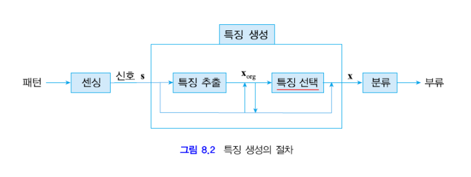

#  기계학습 기말고사 공부  
## 10주차  
### 특징 생성  
필기 숫자 인식과 같은 상황에서 특징 추출을 필요로 한다.  
필기숫자가 적힌 이미지의 크기를 정규화하여 맞추고, 이를 검은색 부분(글자)과 흰색 부분(배경)으로 1과 0을 사용하여 이진화 시킨다.  
이렇게 특징을 추출해낼 수 있는데, 추출 방법은 다음과 같다.  
1. 8x8의 64개의 픽셀을 모두 특징으로 삼아서 64차원의 특징 벡터로 저장하는 방법  
2. 가로 이등분, 세로 이등분을 하여 검은 화소가 몇개 들어있는지 비율을 얻어내어 특징으로 삼는다. 행(세로 2등분) x1=6/18  
열(가로 2등분) x2=14/10  
3. 그 외에도 여러 방법들이 있다.  

<b>특징이 우수한가 판단하는 기준</b>  
- 분별력 : 특징이 어느 한쪽으로 치우치지 않고 좋은 분별력을 가지는가  
- 차원 : 낮은 차원으로도 더 분류를 잘 하는 특징인가  

실제 세계에 있는 정보(Analog)를 패턴을 통해 특징 벡터라는 수학적 표현으로 변환한다.  
이렇게 특징벡터로 어떤 패턴으로 추상화할지는 정해진 것이 아니기에 동일한 데이터라도 특징은 각양각색이 될 수 있다.  
- 보통 특징 추출은 외부환경에 맞게 설계한다.  
숫자와 한글은 다른 특징이 필요할 수 있다는 것, 정면 얼굴만 인식하는 경우와 제약 없이 얼굴 인식하는 경우가 다른 특징이 사용될 수 있다는 것이 그 예시.  

### 특징 추출
특징을 생성하기 위해서는 먼저 특징을 추출해내야 한다.  
실제세계의 정보를 특징벡터로 생성하기 위해 특징을 추출하는데, 그 과정은 센싱을 통해 얻는다.  
센싱에서 얻을 수 있는 신호는 다양한데,  
대표적으로 <b>영상 / 시간성 신호 / 측정 벡터</b>  
이렇게 세가지의 신호를 얻을 수 있다.  
또한 특징은 다양한 상황으로 생성될 수 있다.  
- x.=s. 처럼 센싱된 신호 자체를 특징벡터로 지정할 수도 있고,  
- x.=e(s.) 처럼 특징을 추출하여 특징벡터로 지정할 수도 있고,  
- x.=s(s.) 처럼 특징을 추출한 것 중 마음에 드는 것을 선택하여 특징벡터로 선택할 수도 있고,  
- x.=s(e(s.))처럼 센싱된 신호에서 특징을 추출하고 그 결과 중 마음에 드는 것을 선택하여 특징벡터로 선택할 수도 있다.  

### 주성분 분석 (PCA)  
주성분 분석 : Principal Component Analysis  
훈련집합을 이용해서 매개변수를 추정하고 그것을 통해 특징을 추출하는 것을 의미한다.  
<b>'정보 손실을 최소화하는 조건에서 차원을 축소한다'</b>  
이러한 변환을 Karhunen-Loeve(KL)변환, Hotelling변환 이라고도 부른다.  

<b>주성분 분석을 하는 목적</b>  
정보손실을 최소화하면서 신호 s.를 낮은 차원의 특징벡터 x로 변환하기 위함.  
D차원의 신호s.를 d차원의 특징벡터x.로 변환한다.  
변환행렬 U.는 dxD행렬이다.  

해결해야 하는문제는  
1. 어떻게 차원축소를 표현할지  
2. 정보손실을 어떻게 수량화하여 최소화할지.  

- 차원 축소 표현 : D차원 단위벡터를 u.^T축으로 투영하여 축소한다.  
예를들면 2차원의 s1,s2축으로 이루어진 s.를 임의의 u.^T=(1,0) 벡터를 기준으로 s.에 있는 원소들과 직각이 되는 점을 새로운 1차원의 특징벡터로 나타낸다.  
투영변환된 샘플 ^x = u.^T*s. 이다.

- 정보 손실 공식화 : 원래의 훈련집합이 갖고있는 정보는 샘플들 간 거리, 상대적인 위치 정도이다.  
PCA의 경우에는 샘플들이 원래 공간에 <b>'퍼져있는 정도'</b>를 얼마나 변환된 공간에서 잘 '유지'하는지를 척도로 한다.  
따라서 이를 공식화하면 변환된 샘플들 중 분산을 최대로 하는 축(단위벡터 u.)을 고르는 것이 정보 손실을 줄일 수 있는 공식이라고 할 수 있다.  
> 분산은 샘플들의 평균을 구하고 모든 샘플의 (x-평균)*(x-평균)^T 한 것의 1/n값을 구하면 된다.  

이러한 분산이 가장 큰 공간을 택한다면 차원축소가 그나마 가장 잘 된 경우를 택할 수 있을 것이다.  

분산을 최대화하는 u.를 찾으면 되기에,  
L(u.) 라그랑제 함수를 통해 라그랑제승수가 있는 수식을 미분하고 정리하면  
<b>공분산행렬 * u. = 라그랑제승수 * u. 가 나온다</b>  
즉, 훈련집합의 공분산 행렬 시그마를 구하고 그것의 고유벡터를 구하면 그게 바로 최대분산을 갖는 단위벡터 u.가 된다.  

만약 예로 특정 훈련집합과 그에 관한 공분산 행렬이 존재한다면, 라그랑제승수가 가장 큰 고유벡터를 최대분산을 갖는 u.로 생각하면 된다.  
그렇게 구한 u.^T에 s.를 곱하여 변환된 특징벡터 x.를 구할 수 있다.  

### 변환행렬  
변환행렬을 어떻게 하는지에 따라서 차원축소를 자유롭게 할 수 있다.  
D개의 고유벡터(D차원)가 d개의 고유벡터(d차원)으로 변환된다.  
고유값이 큰 순서대로 d개의 고유벡터를 취한다.  
U. = (u.1^T, u.2^T, u.3^T, ... u.d^T)  
실제로는 x. = U.s. 을 하고 이를통해 d차원으로 변환한다.  

> 구하는 순서는 s.의 집합 X.의 평균벡터를 구하고, 공분산 행렬 시그마를 구한다.  
시그마의 고유벡터와 고유값을 구하고, 고유값을 기준으로 삼아 가장 큰 d개의 고유벡터를 선택한다.  
이렇게 선택된 u1., u2., ... ud.를 통해 변환행렬 U.를 만든다.  

고유값이 작은 u.를 선택했을 때와, 큰 u.를 선택했을 때의 결과를 비교하면 고유값이 작은 u.을 택할때 투영된 점들의 분산값이 더욱 작아지고, 반대로 큰 u.를 택하면 분산값이 커진다.  

### Fisher 선형 분별  
PCA원리와 유사한 분류기 설계이다. 특징추출이 아님. PCA와 목표가 다르다.  
- PCA : 정보 손실을 최소화하며 차원축소 (샘플 부류정보 사용X)  
- Fisher LD : 분별력을 최대화 (샘플 부류정보 사용O)  

축을 기준으로 투영하는것까지는 동일하다. 하지만 분산값을 통해 구분하는 것이 아닌, 여러 축 중에서 가장 기존 분류 결과를 잘 유지하며 차원축소를하는 것을 목표로 한다. (분별력 최대화; 샘플부류정보 필요함)  

**목표 (분별력 공식화)**  
같은 부류는 모여져있고 다른 부류는 멀리 떨어진 것이 가장 이상적인 형태이다.  
w1끼리는 모이고(부류 내 퍼짐은 낮음) w1와 w2는 멀리한(부류 간 퍼짐은 높음) 형태.  
부류 내 퍼짐은 최소화 (평균s1^2 + 평균s2^2 최소화)  
부류 간 퍼짐은 최대화 (평균si^2 = 시그마(y-mi)^2) = |m1-m2| = |w.^Tm1-w.^Tm2| = |w.^T(m1-m2)|

따라서 목적함수 J(w.)는  
J(w.) = 부류간퍼짐/부류내퍼짐 이고, J(w.)를 최대화하는 w.를 찾으면 된다.  
정리하여 다시쓰면 J(w.)=w.^TSbw. / w.^TSwW.  
Sw = S1+S2 이고, Si = 시그마(x.-mi.)(x.-mi.)^T  
구하고자 한 최적의 축은 **w.=알파 Sw^(-1)(m1-m2)**  
알파는 그냥 정해도 되는데 w.의 크기를 조절할 수 있다.  
w.를 1로 만들기 위한 값을 넣는 경우가 많다?  
예를들어 a'(1,4)^T = w. = 1이 되려면..  
a'^2 + (4a')^2 = 1, 17a'^2=1 , a'=1/루트(17)  
w.=(1/루트17, 4/루트17)^T  

### 실용적 관점  
특징 추출은많은 경험을 통해 시행착오를 필요로 하는 단계이다.  
따라서 특징 추출을 위한 기계학습까지 하는 상황. 그 학습을 위해 또 학습을 그 학습을 위해 또 학습을..  

- 특징이 불만족스럽다면 버릴줄도 알아야한다.  
혹은 기존 특징에 새로운 특징을 추가하는 방법으로 특징을 결합해야한다.  
- 특징이 거리개념이 없는 경우도 있다.  
혈액형처럼 거리개념이 없다면, xi를 xi={xi1, xi2, ..., xin}처럼 몇개의 값을 갖는지에 따라 확장시키고, 하나만 1을 갖고 나머지는 0을 갖는 형태로 거리개념처럼 만들어준다.  
예시로 혈액형이 A,B,O,AB이니 xA={1,0,0,0}, xB={0,1,0,0}, ... 이렇게 만들어서 분류해준다.  

특징마다 동적범위가 다른경우가 많다. 예를들어 키는 160-180인데, 몸무게는 40-100으로 큰 차이가 난다고 해보자. 이런 경우 이 둘의 영향력을 같게하기 위해 정규화를 거칠 수 있다.  
- 선형 변환  
new xi = lowi + (highi-lowi)/(maxi-mini) * (xi-mini)  
- 통계에 의한 변환 (평균은 0, 표준편차는 1을 갖도록 정규화)  

이렇게 정규화를 거치면 거리 계산할 때 특징마다 동적범위를 신경쓰지 않고 할 수 있게된다.  

## 11주차  
### 특징선택  
여러개의 특징을 추출하였다면, 그 중에서 분류에 유용한 특징을 찾아내어 선택하는 것이 중요하다.  
특징선택은 추출해낸 기존 특징벡터에서 **쓸모없거나**, **중복성이 강한**특징을 찾아 제거하는 작업이라고 할 수 있다.  
이 과정으로 차원을 낮추어주고 그 덕에 계산속도 향상과 일반화 능력 증대효과를 기대할 수 있다.  
  

직관적으로 이해해보면 부류내 분산은 작고, 부류간 분산이 크다면 가장 좋은 경우일 것이다.  
반면 부류내 분산은 크고 부류간 분산은 작다면 값들이 섞이기 쉬워 좋지 않은 상황일 것이다.  
그리고 최악은 부류간 분산이 0에 가까워서 분별력이 거의 없는 경우일 것이다.  
이처럼 부류내분산과 부류간분산이 끼치는 영향은 정말 크다.  
**부류내 분산은 작고 부류간 분산이 큰 특징벡터가 좋은 특징벡터이다.**  
> 웬만하면 직관적으로 시각적표현을 보고 이해할 수 있지만 매우 높은 차원 데이터는 특징공간을 시각적으로 표현하기 어렵다. 대표적인 예시가 얼굴인식 혹은 필기문자인식이다.  

분별력 (discriminator power) / 부류분리 (class separation)  
우리는 좋은 특징벡터(부류내분산 작고 부류간 분산 큰)를 찾기 위해서 좋고 나쁨을 수량적으로 평가할 수 있는 기준함수가 필요하다.  

이를 평가하기 위한 척도로 사용하는 세 가지가 있다.  
- 다이버전스 : 확률분포 간 거리를 이용하여 분포간 거리가 멀수록 좋은 특징임을 안다. 이를 위한 거리측정은 KL다이버전스를 활용한다.  
부류 2개 : dij = KL(p(x.|wi), p(x.|wj)) + KL(p(x.|wj), p(x.|wi))  
부류 M개 : d = 시그마(i=1에서M)시그마(j=1에서M)P(wi)P(wj)dij  
다만 확률분포를 알고있어야만 적용이 가능하다. 또한 차원의 저주 문제를 이어받는다.  
- 훈련 샘플의 거리 : 다이버전스보다 비교적 현실에서 적용이 쉬운 경우이다.  
훈련집합에 있는 샘플을 가지고 직접 측정을 한다. 훈련집합에 있는 특정 부류 내 샘플들 각각을 기준으로 다른 부류 내 샘플들과의 거리를 전부 더하고 두 부류의 샘플 개수끼리 곱한만큼으로 나누어 부류간 거리의 평균을 구하는 방법이다.  
식으로 쓰면 dij = 1/NiNj * 시그마(k=1에서Ni)시그마(m=1에서Nj)dist(xi.^k, xj.^m) 이다.  
거리측정은 마할라노비스 혹은 유클리디언 거리 측정방식을 사용한다.  
- 분류기 성능 : 선택한 분류기(예를들면 SVM)가 있으면 특징벡터 x를 그 분류기로 평가한다.  
훈련집합을 분류기로 학습하고, 검증 집합을 통해 성능을 측정하는데 이 성능을 벡터의 분별력으로 사용한다.  
'분류기 성능'을 기준으로 좋은벡터를 찾으면 사용하고자하는 분류기에 적합한 특징벡터를 찾을 수 있기에 좋은 결과를 기대할 수 있다.  
하지만 새로운 특징벡터가 추가될 때마다 분류기를 훈련해야한다는 단점이 존재한다.  
이는 계산에 있어서 상당한 시간을 소요한다는 것을 의미한다.  
새로운 특징벡터가 자주 추가되는 상황이면 그닥.. 아니면 괜찮

우리는 위에서 특징선택을 위한 작업으로 쓸모없는것 제거, 중복성 강한 특징 제거를 언급했었다.  
중복성을 제거한다는것은 예시를 들면 강아지와 고양이를 구분하는데에 눈과 코의 개수 같은 특징들은 두 동물을 분류하는데에는 도움이 되지 않기에 쓸모가 없다.  
또한 같은 기능을 하는 두 특징이 있다면 두 기능을 합쳐서 하나만 존재해도 될 것이다.  
이와 같은 특징선택 과정은 직관이 필요하기에 실제 상황에서는 사용이 힘들다. 따라서 효과적 알고리즘이 필요하다.  

특징선택은 원래의특징집합을 부분집합생성기를 통해 특징들의 다양한 조합을 만들어 분별력측정기로 점수를 측정하고, 그 중 가장 높은 점수를 얻는 **최적부분집합을** 가져온다. 그 집합이 바로 선택된 특징들이다.  
특징이 3개라면 {x1}, {x2}, {x3}, {x1,x2}, {x1,x3}, {x2,x3}, {x1,x2,x3} 이렇게 7개 (2^3 -1)의 부분집합이 만들어 질 수 있다.  
이 중 가장 높은 점수를 갖는 부분집합이 바로 '선택된 특징벡터'이다.  

위같은 조합적최적화는 지수승을 갖기에 차원d가 커질수록 걸리는 시간은 방대하게 늘어난다. 부분집합 하나의 평가가 1/1000초가 걸려도 특징벡터가 10개일때 1초가 걸리던 평가가 30개일때 12일이 걸리게 된다.  
그렇기에 모든 경우를 전부 탐색하는것 외에 다른 알고리즘을 찾게 된다.  
- 임의 탐색 알고리즘 : 일정 시간동안 랜덤으로 부분집합을 생성하고 평가하여 가장 좋은 점수를 갖는 부분집합을 택하는 것
- 개별 특징 알고리즘 : 각 훈련샘플들 개별적으로 점수를 먼저 측정한다. 만약 특징이 3개라면 J(x1), J(x2), J(x3)를 계산함. 그렇게 계산되는 값들 중 가장 높은 값을 갖는 훈련샘플들을 택하여 부분집합으로 만드는 방식이다.  
부분집합의 크기가(부분집합 특징이 몇개인지) 얼마나 되는지만 알면 최선의 훈련샘플들을 i개 골라서 특징선택을 할 수 있다.  
하지만 이 알고리즘은 특징 간의 상관관계를 전혀 고려하지 않고있고, 특징의 중복성을 무시한다는 단점을 갖고있다.  

> 그럼에도 간단히 사용하기 쉬운 알고리즘이고, 상관관계가 좀 있어도 어느정도 보완도 된다. 중복을 제거 못하는것이 가장 치명적인 이유  
**전역 탐색 알고리즘**   
- 낱낱 탐색 알고리즘 : 가능성 있는 모든 해를 평가하는 무식한 방법.  
항상 전역최적해를 보장하지만 위에서 언급한대로 해를구하지 못한다든 한계가 존재한다.  
- 한정 분기 알고리즘 : 전역탐색알고리즘의 낱낱탐색알고리즘 강화판이다.  
모든 가능성있는 해를 평가하는 낱낱탐색알고리즘에서 탐색하면서 도중에 가능성이 없다고 판단되는 영역을 아예 배재하여 효율을 높이는 방식의 알고리즘이다.  
차원수가 낮아질수록 점수가 낮아지는데, 2차원 분기 점수보다 3차원에서 점수가 더 낮으면 그쪽 분기의 3차원 아래 분기로는 갈 이유가 없다.  
이미 탐색했던 분기 중 2차원에서 얻은 최대점수 분기보단 최소한 3차원에서 더 높은 점수를 갖는 분기를 탐색해야한다는 생각.  

전역탐색알고리즘은 위와같이 다소 무식한 방법이라 시간이 오래걸린다.  
따라서 순차 탐색 알고리즘이라는 것도 존재한다.  
**순차 탐색 알고리즘**  
- SFS 알고리즘 (sequential forward search algorithm) :  
한번에 하나씩 특징을 추가하는 알고리즘. 공집합을 하나 만들고, 기존특징집합에서 점수가 가장 높은 특징벡터를 하나씩 공집합에 추가해나가며 점수가 가장 높은 부분집합의 경우를 찾는 방식  
[d1,d2]로 부분집합의 개수가 정해지는데, 이건 범위를 나타낸다.  
d개 특징벡터가 d1차원부터 d2차원까지의 결과 중 가장 점수가 높은 조합으로 선택하는 알고리즘이다.  
- PTA 알고리즘 (plus-p-take-away-q algorithm) :  
p개의 특징을 추가하고 q개를 제거하는 연산을 반복하는 알고리즘이다.  
부분집합을 공집합으로 시작하여 가장 점수가 높은 특징벡터들을 p개 추가하고, 그 중에서 가장 점수가 낮은 특징벡터들을 q개 빼서 부분집합으로 만든다. 그리고 [d1,d2]차원 범위에 있는 결과 중 가장 점수가 높은 조합으로 선택하는것이 바로 PTA알고리즘이다.  

### 통계적 탐색 알고리즘  
위에서 말한 순차 탐색 알고리즘들은 욕심(GREEDY) 알고리즘이다.  
전역최적해가 아닌 지역최적해로 빠질 수 있는데, 그나마 PTA가 전역 최적해도 찾아갈 수 있는 가능성이 있다.  
이런 문제는 통계적 탐색 알고리즘을 사용하여 이를 극복할 수 있다.  
- 시뮬레이티드 어닐링 : 언제나 우수한 해로 이동하는 것이 아니라, 열등한 해로 이동도 하는 '담금질 기법'으로 다양한 형태를 나타낸다.  
- 유전 알고리즘 : 자식해가 꼭 좋은쪽으로만 가는것은 아니다. 임의의 해들을 찾아가는데 그곳들 중 더 좋은 성능을 갖는 해쪽으로 향한다.  
즉, 이곳저곳 방문하고 한번 알고리즘이 더 돌아가서 더욱 좋은 성능을 갖는 해쪽으로 향한다.  
이렇게 유전적으로 좀 더 성능이 좋아지도록 향하는, 뒤로 돌아가기도 하고 최적으로 가기도하며 여러 탐색을 하는것이 유전알고리즘이다.  

## 12주차  
### 기계학습 종류
기계학습에는 세가지 유형이 있다.  
- 지도학습 : 모든 훈련샘플이 레이블(결과) 정보를 가짐
- 비지도학습 : 모든 훈련샘플이 레이블(결과) 정보를 갖지 않음 
- 준지도학습 : 레이블을 갖는 샘플과 갖지않는 샘플이 섞여 있음

11주차까지 배운 기계학습은 지도학습에 관한 내용이다.  
현실에서는 많은 데이터들이 준지도학습으로 학습을 한다. 세상엔 방대한 데이터들이 있고 레이블을 갖는 데이터와 갖지않는 데이터가 다양하게 섞여있기 때문이다.  
지금까지는 레이블이 있는 경우를 다루었는데 수많은 데이터가 사실은 레이블이 없이 존재하는 편이다.  

부류정보가 존재하는 지도학습의 종류는 이전에 배운 베이시언분류기, MLP, SVM 등이 있다.  
부류정보가 존재하지 않는 비지도학습은 **군집화**라는 것을 통해 학습을 한다. 군집이 몇개인지 주어지기도 하고, 주어지지 않기도 한다.  
이렇게 군집화하는 과정을 **부류발견 작업**이라고도 한다.  

기계학습은 두 종류의 지식을 통해 학습을 한다.  
훈련집합, 사전지식(세상의 일반적 규칙)  
비지도학습과 준지도학습은 사전지식을 더 명시적으로 활용하는 학습이라고 할 수 있다.  

### 비지도 학습
비지도학습은 군집화를 통해 학습을 한다.  
지도학습에서의 과업이 다양하듯, 비지도학습도 과업이 세가지 있다.  
1. 군집화 : 유사한 샘플을 모아서 같은 그룹으로 묶는 일
2. 밀도 추정 : 데이터로부터 확률분포를 추정하는 일
3. 공간 변환 : 원래 특징공간을 저차원 or 고차원으로 변환하는 일. 보통은 저차원으로 변환한다

과업에서 볼 수 있듯 데이터에 내재한 구조를 잘 파악해서 새로운 정보를 발견해야 한다.  

**위 세가지의 과업을 응용하여 어떠한 일을 할 수 있을까**  
- 군집화를 통해 사람들을 같은 그룹으로 묶어서 맞춤광고, 영상분할, 유전자 데이터 분석, SNS실시간 검색어 분석 후 관심파악 등  
- 밀도추정을 통해 만들어진 그룹을 분류하고 생성모델을 구축하는 등  
- 공간변환을 통해 데이터를 가시화하거나 압축하고, 특징을 추출하는 등

### 군집화  
만약 대형 온라인쇼핑몰을 운영하면서 고객의 취향을 분석하여 그에 따라 4-6개의 팜플렛을 만들어 맞춤홍보를 하려고 생각할 때,  
수백만명이나 되는 고객들을 어떻게 4-6개의 그룹으로 분류할 수 있을까  

바로 **유사함**을 알 수 있어야 한다.  
유사한 샘플의 집합을 군집이라고 하는데, 군집해가 몇개인지 어떤것이 정답이고 오답인지 군집화 알고리즘에서는 존재하지 않는다. 따라서 **주관성**이 들어갈 수밖에 없다.  
왜냐면 군집화 결과의 품질은 처한 상황이나 요구사항에 따라 다르기 때문이다.  
군집화를 구현하기 위해서는 '거리에 대한 척도', '유사한 샘플을 군집화하는 알고리즘' 이렇게 두가지가 필요하다.  

군집화의 목표는, 같은 군집내 샘플을 서로 가깝고 다른 군집에 속한 샘플 사이의거리는 멀게하는 것이다.  
가깝다 멀다는 거리개념인데, 이 거리개념의 계산 방법은 개발되어 있고 어떤 방법을 쓰느냐에 따라 결과를 달라질수도 있다.  
따라서 적합한 거리측정방법을 사용하는것이 중요하다.  

거리와 유사도는 반비례관계인데, 따라서 거리와 유사도 둘 중 하나만 알면 다른 나머지 하나를 알 수 있다.  
거리 UP -> 유사도 DOWN , 거리 DOWN -> 유사도 UP  

특징의 종류는 다양하다.  
- 양적 특징  
    - 수량값 - 거리개념 있음  
- 질적 특징
    - 순서값(오디널) - 거리개념 있음
    - 명칭값(노미널) - 거리개념 없음

양적특징은 나이, 연봉, 몸무게 등 수치로 거리개념이 측정이 가능하다.  
질적특징은 순서값(오디널)과 명칭값(노미널)로 나뉘는데,  
**반품성향, 제품선호도, 소비자만족도(상중하)** 등 처럼 수치로는 나타내지지 않지만 거리개념은 존재하는 **순서값(오디널)**,  
그리고 **혈액형, 직업, 성별**처럼 거리개념이 존재하지 않는 **명칭값(노미널)**이 존재한다.  
즉, 순서값(오디널)이란 Sorting이 가능한 질적특징을 말한다.  

### 거리, 유사도 측정  
거리와 유사도를 측정하는 방법은 다양하다  
**거리 측정**  
- Minkowski 거리 : 두 점 xi.와 xj.간의 거리 척도  
dij = (시그마(k=1에서d)|xik - xjk|^p)^(1/p)  
p=2면 유클리디안 거리, p=1이면 도시블록 거리  
- Hamming 거리 : 이진 특징벡터에 적용가능 (서로 다른 비트의 개수)
특징벡터가 0과 1로만 이루어져있다면 서로 같은 개수의 특징벡터를 갖는 두 군집에서 같은 index의 특징벡터가 다른지 같은지를 통해 해밍거리를 측정한다.  
예시로 (1,0,1,0,0,0,1,1)^T와 (1,0,0,1,0,0,1,0)^T가 있으면 다른 벡터는 총 3개. 따라서 해밍거리는 3이다.  

**유사도 측정**  
- 코사인 유사도 : 문서검색 응용에서 주로 사용 (단어가 특징이고 출현빈도가 특징값이다)  
sij = cos세타 = xi.^T * xj. / ||xi.|| * ||xj.||  
- 이진 특징 벡터의 유사도 :  
sij = n00 + n11 / n00 + n11 + n01 + n10  
sij = n11 / n11 + n01 + n10  
- 유사도와 거리는 쉽게 상호변환 할 수 있다  
sij = dmax - dij  
dij = smax - sij  

### 점 집합에서 거리 구하기  
점x.와 점집합군집cj 간의 거리를 D(xi., cj)로 표기한다.  
두 군집 ci cj간 거리는 D(ci, cj)로 표기한다.  
- 점과 군집사이 거리를 구하는 방법은 여러가지가 있다.  
Dmax / Dmin / Dave / Dmean / Drep  
- Dmax와 Dmin은 외톨이(outlier)에 민감하다. 군집 간 가장 먼(max), 가까운(min) 원소들을 대표로 설정하는 방법이다.
- Dmean은 평균을 대표로 삼는 방법이다.
- Drep은 같은 부류 내, 다른 원소들과 가장 가까운 샘플을 그 군집의 대표로 삼는다.

### 군집화 알고리즘 분류  
군집화 알고리즘은 너무 다양하다.  
그렇기에 어떻게 군집화 시킬지는 주관이 많이 개입된다.  
분류는 크게 두개로 나뉜다.  
- 계층 군집화 : 군집 결과를 계층 덴드로그램으로 표현
- 분할 군집화 : 각 샘플을 군집에 배정하는 연산을 사용

### 분할 군집화
- 순차 알고리즘 : 군집개수를 찾아주는데 대신 **임계값 설정**해야함. 순서에 민감하고 빠르다 (선형시간)  
군집 개수를 설정해주면 한개 군집을 갖고 출발하여 xi와 가장 가까운 군집 cq를 찾고 혹시 임계값보다 멀면 새로운 군집을 만들고, 임계값보다 가까우면 xi이 속한 군집에 넣는다.  
- k-means 알고리즘 : 가장 널리 쓰이고 직관적이해가 되고 구현이 간편하다. **단 군집의 개수를 설정**해주어야한다.  
k개의 군집 중심 Z. 를 초기화하여 시작. 만약 5개 샘플 있는데 군집개수가 3개면 {x1},{x2},{x3,x4,x5}처럼 3개의 군집으로 초기화해준다.  
xi.를 가장 가까운군집 중심에 배정하고, zj에 배정된 샘플 평균으로 zj를 대치하는데 이를 반복.  
루프했는데 이전이랑 결과가 같을때까지 반복  
**이론적인 배경**은  
J(Z,U.)=시그마(i=1에서N)시그마(j=1에서k)uji||xi.-zj.||^2  
위 함수를 비용으로 하는 내리막경사법의 일종  
k-means 알고리즘은 항상 지역최적점으로 수렴하고(전역최적점 보장X)  
초기 군집 중심에 민감하다. 그리고 외톨이에 민감하다. 그래도 빠르다  
k-medoids라는것도 있는데, 얘는 중간점을 대표로 삼는 방법이다. 이 방법을 쓰면 외톨이에 보다 강한 군집을 만들 수 있다.  
- 모델 기반 알고리즘 : 샘플로부터 가우시언을 추정하고 그 결과에 따라 군집을 배정하는 방법이다.  
가우시언 추정은 EM 알고리즘 사용가능

## 13주차  
### 비지도학습 - 계층군집화  
12주차에서는 분할군집화에 대해 학습했다  
계층군집화는 군집결과를 계층구조의 덴드로그램으로 표현하는 군집화를 말한다.  
덴드로그램으로 표현했을 때 직관적으로 가까운 군집들이 눈에 보이게된다.  
계층대로 군집화되는 과정이 있다면.. 계층을 여러군집에서 하나의 군집으로 되는 과정, 하나의 군집에서 여러 군집으로 나뉘는것 둘로 종류가 나뉜다.  

- 응집 계층 알고리즘(agglomerative) : 샘플 각각이 군집이 되어 시작. 유사한 군집을 모으는 작업을 반복한다. 군집내 샘플 간 거리를 Dmin, Dmax 등 다양한 방법 중 하나로 거리측정하고, 여러 군집간 거리 중 가장 가까운 군집끼리 합치는 작업을 반복한다. 거리 척도는 기본적으로는 Dmin(단일)을 사용하고 Dmax(완전), Dave(평균), Dmean, Drep 도 사용이 가능하다.  
단일연결(Dmin)은 긴 군집 완전연결(Dmax)은 둥근 군집을 선호한다. 평균은 중간  
원하는 군집이 3개라면 반복하다가 군집개수가 3개일때 멈추면 된다.  
군집개수는 사용자가 지정하거나 자동으로 결정해야하는데 자동은 어렵다.  
단일연결 완전연결은 외톨이에 민감하기에 평균연결이 덜 민감하다.  

> 파이썬을 사용해서 샘플 간 모든 거리도 출력이 가능하고 squareform으로 배열표현도 가능하다. linkage로 single(Dmin), complete(Dmax), average(Dave) 설정이 가능하다. 이러한 군집 간 거리와 군집에 속한 샘플의 수 등으로 덴드로그램을 그릴 수 있게된다.

- 분열 계층 알고리즘(divisive) : 하향방식. 모든 샘플이 하나의 군집으로 출발. 군집을 나누는 작업을 반복하는 알고리즘이다.  
모든 샘플이 하나가 되도록 초기화하고, 여러개의 이진분할을 만들고 그 군집들 끼리 가장 거리가 먼 경우를 cq1, cq2라고 하고 cq를 제거한뒤 두 군집을 새로 추가하여 나눈다.  
> {x1, x2, x3, x4}가 있을 때 => {x1}{x2,x3,x4}, {x2}{x1,x3,x4}, {x3}{x1,x2,x4}, {x4}{x1,x2,x3}, {x1,x2}{x3,x4}, {x1,x3}{x2,x4}, {x1,x4}{x2,x3} ... 이렇게 2개의 군집이 되는 가능성이 여러개 있는데 이 중 가장 거리가 먼 경우를 택하는 방법이다.  
각 샘플마다의 거리를 구해야해서 계산량이 응집계층보다 훨씬 많다. 모든 경우의 수를 계산해야하기 때문이다.  

### 신경망  
- 지도학습 : 퍼셉트론, 다층 퍼셉트론   
- 비지도학습(군집화) : SOM(self-organizing map), ART(adaptive resonance theory)  

SOM(자기조직화 맵)이란 샘플들을 상호 비교하며 스스로 군집을 조직해내는것이다.  
경쟁학습을 통해 하나 샘플이 입력되면 여러 대표벡터가 경쟁하고, 가장 샘플과 가까운 벡터가 승자가 되어 그것을 취하는 방식이다. (승자독식전략)  
이후 승자는 그 샘플에 적응하도록 벡터값을 조금 변화시킨다.  

퍼셉트론 구조 모양을 떠올려보고.. d차원의 샘플이 입력되면 경쟁층에서 여러개(m개)의 경쟁군집이 각각의 가중치벡터를 통해 경쟁하고 결과를 낸다.  
이런 구조에서 가장 x.샘플과 거리가 가까운 가중치벡터를 승자로 삼아 선택되고, 그에 맞게 그 가중치벡터가 속하는 경쟁층의 벡터값을 x.에 맞게 변화시키는데 이 변화가 바로 학습이다.  

w.new는 w.old보다 x.에 가까운 형태가 된다. 가중치는 로우값(0 - 1)  
- w.new = w.old + 로우(x. - w.old)  
최대 군집개수:m, 학습률:로우, 이웃반경:r / 이웃반경은 근처 가중치들도 같이 학습시켜주는건데 우리는 사용X  

이렇게 SOM학습을 진행하고, 군집해를 이를 활용하여 구하면 된다.  
입력되는 xn.벡터에 가장 가까운 가중치벡터 wq.를 찾고 xn.을 군집cq에 배정한다.  
이렇게 군집cj가 여러 군집이 만들어질텐데... m개의 군집들 중 비어있지 않은 (하나라도 값이 들어있는) 군집들을 골라 군집해 C.를 작성한다.  

## 14주차  
### 준지도학습  
현대에는 Labeling이 있는 샘플과 없는 샘플이 섞여있는 상황이다.  
비용문제로 일부만 labeling해서 그런데, 그렇다고 labeling안된 샘플을 버리기엔 아까워서 적절히 사용하는 방법을 찾는데 이게 바로 준지도학습의 주제이다.  

**준지도학습에서의 훈련집합**  
label이 있는 Xl.={x1.,x2.,..,xn.}, Yl.={y1.,y2.,..,yn.}  
label이 없는 Xu.={xn+1., xn+2., ... , xn+m}  
n개의 label이 있는 샘플들과, m개의 label이 없는 샘플들을 위와 같이 표시한다.  
보통은 m>>n으로 label이 없는 샘플의 개수가 훨씬 많은 경우가 일반적이다.  
> Label이 없는 데이터가 과연 도움이 될까?  
주어진 데이터의 구조에 적합한 모델을 사용하면 성능이 향상되지만,  
문제 구조와 모델이 잘 맞지 않는 경우에는 오히려 성능이 저하되는 경우로 이어질 수 있다.  

### 준지도학습 알고리즘
label이 있는 Xl.과 없는 Xu.를 가지고 (모든샘플들) 비지도학습을 한다.  
즉 Yl.은 무시한 채로 우선 비지도학습을 한다. 이 때 가우시안 혼합을 사용한다.  
각 가우시안은 자신에 속한 샘플을 보고 부류를 정하고, 각 부류는 자신이 속한 가우시안으로 P(x.|y)를 추정한다.  
단, 가우시안 분포에 맞는 데이터여야하고 가우시안 혼합 적용할땐 가우시안 개수를 정확히 알긴 어렵다는 단점.  

**준지도학습 현대적 생성모델**  
현대에선 GAN이라는 것이 발표되어 유망한 상황이다.  
내가 가지고있는 샘플 외에 가짜샘플을 만들어서 그 가짜샘플을 분류하는 분류기를 만들고 더 구분하기 어려운 가짜샘플을 만들고.. 서로 상호발전하는 구조로 이루어졌다.  
G는 가짜샘플을 더 잘 생성되도록, D는 더 가짜를 잘 판별하도록. (예:위조지폐)  

c개의 분류를 수행할 때, 가짜샘플은 c+1레이블을 추가로 사용하여 만든다. 분별기D는 세개의 항을 가짐  
1. 가짜샘플을 c+1에 배정하는 항 (가짜를 가짜로 배정)
2. Xu. 샘플이 c+1에 배정되는 것을 막는 항 (진짜가 가짜로 배정되는걸 막음)
3. Xl. 샘플을 해당 부류로 배정하는 항 (진짜를 진짜로 배정)  

분류기가 맞았는지 틀렸는지 G로 확인하며 계속 학습한다.  

**Self Learning (자가학습)**  
훈련집합 Xl.과 Yl.로 학습기 f를 학습하고  
f로 Xu.중에 잘 학습되어있는 샘플을 분류해서 Yu.를 예측하고  
분류된 Xu.중 신뢰도가 높은 순으로 r%만큼(선택비율) 부분집합을 선발하여  
Xu. = Xu. - Xu_subset.  
Xl. = Xl. U Xu_subset.  
Yl. = Yl. U Yu_subset.  
으로 Xu.에 있는 신뢰도 높은 샘플들을 빼내어 Xl.과 Yl.로 넣는다. 이 과정을 반복하며 점점 높은 신뢰도로 향한다.  
*단, 소속이 애매한 샘플에는 민감한 상황이 발생하기 쉽다 (이상한 방향으로 학습가능성 O)*  

**Co-Training (협동학습)**  
학습기 2개가 서로 협동하여 X_expand.를 확장해나가며 발전한다.  
> Xl.를 2개의 부분공간(x1_subset., x2_subset.)으로 나누고, X_expand.에 Xl.을 복사해놓음  
x1_subset. 시점으로 학습기 f1을 학습, x2_subset. 시점으로 학습기 f2를 학습한다.  
f1으로 Xu.를 분류하고 f2로 Xu.를 분류한다.  
f1 분류결과 신뢰도 가장 높은 q개 샘플을 Xu.에서 X_expand.로 옮기고  
f2 분류결과에서도 신뢰도 가장 높은 q개 샘플 Xu.에서 X_expand.로 옮긴다.  
위 두줄(f1, f2분류결과에 따라 Xu.에서 X_expand.로 옮김)의 옮겨진 샘플들의 예측된 레이블을 Yu.에 추가한다.  
이런 과정을 Xu.의 샘플이 전부 소진될때까지 반복한다.  

만약 학습기 두개가 서로 가르치는 방식으로 구현하고 싶으면  
> X_expand를 2개 만들고..  
X_expand1의 x_subset1. 시점으로 학습기 f1 학습, X_expand2의 x_subset2. 시점으로 학습기 f2 학습  
f1과 f2로 Xu.를 분류  
**f1**의 분류결과에서 신뢰도 가장 높은 q개 샘플을 Xu.에서 **X_expand2**로 옮기고  
**f2**의 분류결과에서 신뢰도 가장 높은 q개 샘플은 Xu.에서 **X_expand1**으로 옮긴다.  
이 과정을 Xu.샘플이 전부 소진될때까지 반복하면 서로가 서로의 분류기를 학습시켜주는 방식으로 협동학습이 가능하다.  

**그래프 방법**  
샘플 사이의 유사도에 따라 그래프 구성  
    샘플마다 k개 최근접이웃 찾아서 에지로 이어주는게 예시.  
최소분할을 적용하여 분할선 찾음  
같은 부분집합에 속하는 샘플에 같은 부류 레이블 부여  

**밀집 지역 회피**  
결정경계가 밀집지역을 지나면 오분류의 가능성이 높아진다. 따라서 밀집지역을 회피해서 결정경계를 정하는 방법이 있다. 예:TSVM(Transductive SVM)  
> 원래라면 Labeling된 샘플만을 기준으로 Support Vector를 구하고 그것을 통해 직선을 만드는 학습을 수행했는데, TSVM의 경우에는 Labeling이 되지 않은 샘플들까지 사용하는 방법이다.  
Labeling이 된 Support Vector샘플들을 기준으로 직선을 만드는 것은 동일하지만, Labeling이 되지 않은 샘플들까지 인지하여 밀집된 지역을 피해서 선을 긋는 방법으로 이루어져 있다.  

## 강화학습
기존의 지도학습과 비지도학습, 준지도학습에서는 불가능했던 과업을 달성할 수 있는 방법이다.  
시간적으로 흐르는 상황에서 그때마다 상태변화, 행동을 번갈아 수행하면서 보상과 벌을통해 목적을 달성한다.  

대표적인 예시가 '아기가 걸음마를 떼는 과정'이라고 할 수 있다.  
아이가 걸음마를 배울때 매우 많은 상황들이 있는데 이것들을 모두 만족하도록 해야할 일들을 학습하는건 말이안됨.  
그저 반복수행하는것만이 답.  

게임, 장기나 바둑같은 게임, 자동차의 자율주행, 로켓발사제어 등  
무한한 상태의 경우 어떻게 행동을 취해야하는가를 알게되는 것이 강화학습의 학습 결과이다.  

핵심연산은 시간에따른 상태, 행동, 보상의 순차적 처리를 통해 점차 강화되는 것.  
s0,r0 --a0-> s1,r1 --a1-> s2,r2 ... --at-1-> st,rt  
보상이 꼭 좋은것만은 아님. 잘못된 행동으로 벌을 받는것도 보상으로 인한 학습  
걷기위해 다양한 행동을 시도하다가 넘어진다? => 보상으로 마이너스 점수  
잘 걸어서 도착지에 무사히 도착했다? => 보상으로 플러스 점수  

### 보상 책정 방안
한걸음 잘 가면 +1점, 넘어지면 -1점, 크게 넘어지면 -10점, 도착지에 잘 도착하면 +100점 막 이런식으로...  
- 보상 책정은 에이전트(agent)와 환경(environment)  
에이전트는 정책을 가지고 행동을 결정함. 정책은 학습으로 알아내야 함  
환경은(MDP)를 갖고 상태전환과 보상액을 결정함. (이 상태전환과 보생액이 바로 정책임)  

강화학습의 목표는 **누적 보상액을 최대화**하는것이다.  
정책에 따라 행동을 결정하기에 좋은 정책을 필요로 한다.  

상태값, 행동값, 보상값은 집합으로 표기가능하다.  
만약 보드판에 칸을 나누고 동서남북으로 이동가능. 이라고하고 판 밖으로 나가면 -1점수, 이동하면 0, 도착지 도착하면 +5로 해두면  
점점 여러번 반복할수록 어떠한 칸에서는 북쪽으로 가면 안되고, 어떠한 칸에서는 동쪽으로 가는게 제일 좋고. 이런 결과가 나오게된다.  
결국 여러번 반복하면 더욱 빠른 시간내에 +5점을 획득하는 최적의 방법을 찾겠지. 보상을 최대화하면서 어떻게 움직일것인지!  

위 보드판 예시에서도.. Policy(정책)을 잘 만들어야함. 확률 규칙으로 행동을 결정하는데, 그냥 동일확률로 만약 동,서,남,북으로 갈 확률을 1/4로 하게되면 언젠가는 최종Goal에 도착할텐데.  
그럴때 최대 보상값인 5점을 받기위한 학습을 할것임 (나가지 않기만 하면 됨)  
따라서 확률이 원래는 어디에서나 동일하게 1/4씩이였는데, 이제는 16개의 칸중 가장자리 칸들에 대해서는 밖으로 나가지 않도록 확률을 조정할 수 있다. (맨 위 칸들은 북쪽으로 갈 확률 0, 왼쪽칸들은 서쪽 갈 확률 0,...)  
그러면 누적보상액은 항상 5점이 될 것이다.  
이렇게 조정하는것이 정책결정이다. 내생각엔 여기서 시간제한 (움직임의 제한. 10번 안에 도착 못하면 -1점같이..) 추가하면 가능해보임  

행동이나 보상, 상태가 여러개일수록 훨씬 복잡한 강화학습이 될 것이다.  
때로는 다양한 방법을 찾아보기위해서 잘못된 행동도 할수있다.  

### 탐험과 탐사
**탐사** : 보상액이 꽤 괜찮아서 그 방법을 계속 수행하는것  
**탐험** : 보상은 좋지만 그래도 다른 공간들을 골고루 찾아보는것  
강화학습에서는 탐험과 탐사를 적절히 조율하며 사용해야한다.  
너무 탐사로 치우쳐지지 않게 주의를 기울여야한다.  

탐사는 2번에서 당첨? => 2번만 고집  
탐험은 2번에서 당첨? => 아 글쿤. 다른것도 해봐야지  
왜 탐사에 기울어지면 안되나면 더 좋은 방식이 있을 수 있는데 그걸 묵과하게됨  

균형방식은 탐사와 탐험을 둘다 적절히 섞어서 사용하는 방법이다.  
2번에서 돌리는 확률을 조금 더 증가시켜보는 방법이다.  
강화학습은 **균형방식**을 사용한다.  

### 마르코프 결정 프로세스
강화학습은 모든 문제를 풀어주지않고 특정 조건을 만족해야만 해결해줄수있음. 그 성질 중 대표적인 것이 바로 **마르코프 성질**.  
행동을 결정할 때, 이전 이력이 중요하지 않다면 마르코프 성질을 만족한다.  

바둑판에서 첫번째에 두었던, 두번째에 두었던 과거에 영향을 받는것이 아닌, 그때그때 펼쳐진 상황에 대해 최적의 방법을 찾아야한다면 그게 마르코프성질을 만족하는 것이다.  

$P(s_{t+1}, r_{t+1}|s_t, a_t) = P(s',r|s,a)$  
마르코프 성질을 만족하지 못하는 경우는 어떤 경우냐,  
어제 비가 왔다면 오늘 비올확률이 좀 더 높을 것이다. 이런경우는 마르코프 성질을 만족못한다.  
마르코프 성질을 만족하게 하기 위해서는 상태 자체를 여러개로 늘려서 문제를 다룰수있게 한다.  
맑은후맑음, 비온후맑음, 눈온후맑음, ..., 눈온후눈 이렇게 여러개로 늘림  

환경 모델로서 MDP(Markov decision process; 마르코프 결정 프로세스)  
- 결정론적 MDP : 상태 10에서 동쪽이라는 행동취하면 항상 11상태로 전환..
- 스토캐스틱 MDP : 가아아끔 돌풍이 불어서 동쪽 행동을 취했는데 일정 확률로 11이 아니라 7이나 15로도 갈수있는 경우를 만들수도 있다?  